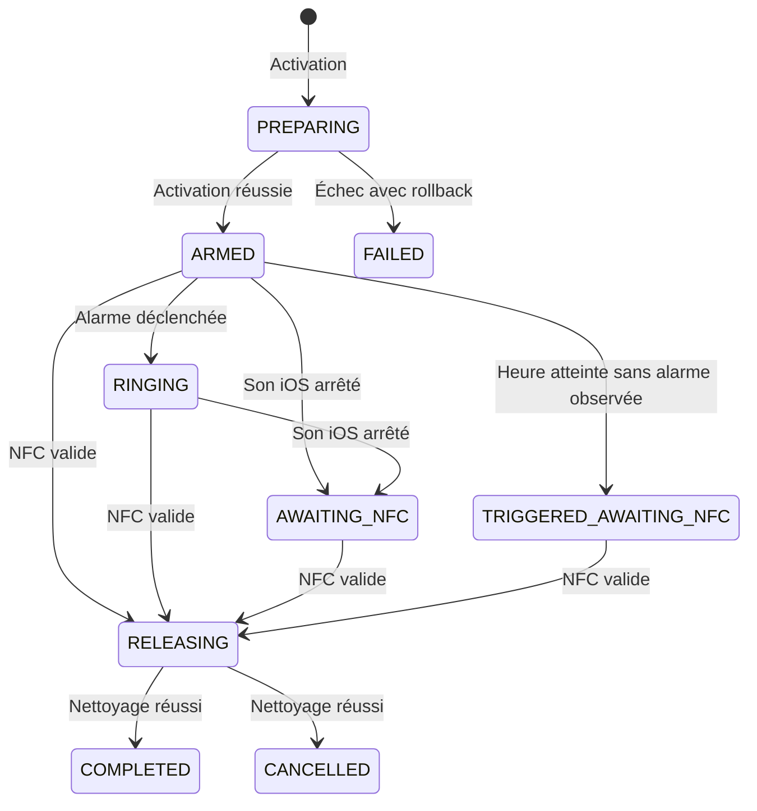

# Niumi Core KMP: spécification métier commune

Statut: contrat proposé pour le MVP Android et iOS
Version du contrat: 1.1
Date de référence: 2 septembre 2026
Plateformes: Android natif et iOS natif
Module partagé: Kotlin Multiplatform

## 1. Objet du document

Cette spécification définit les règles que les applications Android et iOS de Niumi doivent appliquer de la même façon. Elle fixe le modèle de session, les transitions d'état, le calcul du réveil, le protocole NFC, les invariants de blocage et les contrats échangés avec les intégrations natives.

Le module KMP ne remplace pas les deux applications natives. Il fournit leur moteur métier commun.

Les documents de référence sont:

- les décisions produit fixées dans les spécifications Android et iOS;
- `SPEC_ANDROID.md` pour l'implémentation Android;
- `SPEC_IOS.md` pour l'implémentation iOS;
- le présent document pour tout comportement commun aux deux plateformes.

En cas de contradiction, l'ordre de priorité est le suivant:

1. intention produit;
2. présent contrat KMP;
3. spécification de la plateforme concernée;
4. code de l'application.

Une limite imposée par Android ou iOS peut justifier une exception native. Cette exception doit être nommée, testée et ajoutée aux trois spécifications. Elle ne doit pas être introduite uniquement dans le code.

## 2. Décisions communes fixées pour le MVP

Les décisions suivantes s'appliquent aux deux applications:

1. Une seule session Niumi peut être active sur un appareil.
2. Une session active fonctionne sans réseau pour le réveil, le blocage, le scan et la fin de session.
3. Une session ne se termine qu'après validation locale du boîtier associé.
4. Avant le réveil, une modification ou une annulation exige également ce scan. Le résultat final est alors `CANCELLED`.
5. Pendant ou après le réveil, un scan valide mène à `COMPLETED` après nettoyage des sous-systèmes.
6. L'arrêt du son fourni par iOS ne termine pas la session et ne retire pas les blocages.
7. Android ne fournit aucun bouton logiciel d'arrêt dans le parcours Niumi.
8. Le passage à un état final se fait seulement après une phase `RELEASING` réussie.
9. Le réveil conserve l'instant calculé lors de l'activation. Un changement de fuseau ne déplace pas cet instant.
10. Le même tag NFC physique doit être reconnu par Android et iOS.
11. L'utilisateur sélectionne entre 1 et 50 applications.
12. Le MVP ne propose aucun secours logiciel immédiat si le boîtier ou le NFC est indisponible.

L'absence de secours logiciel est une contrainte produit assumée. L'activation vérifie que le NFC est disponible et que le boîtier associé a été validé; l'application ne présente ni délai, ni code, ni bouton de déblocage comme solution de récupération.

## 3. Périmètre du module partagé

### 3.1 Code placé dans KMP

Le module `:shared:core` contient:

- les états, événements, effets et violations métier;
- le réducteur de session;
- les règles d'activation, d'annulation et de fin;
- le calcul du prochain réveil;
- la politique de changement d'heure et de fuseau;
- le parseur strict du payload NFC;
- la vérification d'un boîtier à partir d'une empreinte locale;
- les limites communes de sélection d'applications;
- les niveaux de diagnostic et les incidents communs;
- les DTO exposés à Swift;
- les tests métier et les jeux de données de référence.

### 3.2 Code qui reste natif

| Android | iOS |
| --- | --- |
| Jetpack Compose | SwiftUI |
| AlarmManager et PendingIntent | AlarmKit et App Intents |
| Foreground Service, audio, vibration et wake lock | présentation et contrôle sonore AlarmKit |
| AccessibilityService | FamilyControls et ManagedSettings |
| NfcAdapter Reader Mode | Core NFC |
| Room, DataStore et Direct Boot | SwiftData, App Group et Keychain |
| packages Android sélectionnés | jetons opaques Family Controls |
| notifications et plein écran | extensions de shield |

Le code commun n'importe aucune API Android ou Apple. Il ne connaît ni `Context`, ni `AlarmManager`, ni `NfcAdapter`, ni `AlarmKit`, ni `ManagedSettingsStore`.

## 4. Invariants produit

Le moteur commun doit refuser toute transition qui enfreint un invariant.

- Une seule session non finale peut exister, y compris pendant `PREPARING`.
- `FAILED` est réservé à une activation qui n'a jamais abouti.
- Une session déjà armée ne passe pas à `FAILED` à cause d'un incident technique.
- Un NFC invalide ne modifie ni l'état, ni le blocage, ni le son.
- `nfcVerifiedAt` doit exister avant l'entrée dans `RELEASING`.
- `COMPLETED` et `CANCELLED` ne sont atteints qu'après réussite du nettoyage.
- Le blocage reste demandé dans `ARMED`, `RINGING`, `AWAITING_NFC` et `TRIGGERED_AWAITING_NFC`.
- `RELEASING` autorise un nettoyage partiel. L'état seul ne permet pas de déduire si le blocage natif est encore appliqué.
- L'arrêt sonore iOS n'est jamais traité comme une preuve NFC.
- Aucun événement réseau n'est nécessaire pour autoriser une transition.
- Un événement ancien ou destiné à une autre session ne peut pas faire régresser l'état. Le coordinateur natif déduplique les événements avant d'appeler le moteur.

## 5. Machine à états commune

```kotlin
enum class SessionState {
    PREPARING,
    ARMED,
    RINGING,
    AWAITING_NFC,
    TRIGGERED_AWAITING_NFC,
    RELEASING,
    COMPLETED,
    CANCELLED,
    FAILED
}

enum class ReleaseTarget {
    COMPLETED,
    CANCELLED
}
```



### 5.1 Transitions autorisées

| État source | Événement | État cible | Cible de libération |
| --- | --- | --- | --- |
| aucun | `ACTIVATION_REQUESTED` | `PREPARING` | aucune |
| `PREPARING` | `ACTIVATION_SUCCEEDED` | `ARMED` | aucune |
| `PREPARING` | `ACTIVATION_FAILED` | `FAILED` | aucune |
| `ARMED` | `ALARM_FIRED` | `RINGING` | aucune |
| `ARMED` ou `RINGING` | `ALARM_SOUND_STOPPED` | `AWAITING_NFC` | aucune |
| `ARMED` | `TRIGGER_ELAPSED` | `TRIGGERED_AWAITING_NFC` | aucune |
| `TRIGGERED_AWAITING_NFC` | `ALARM_SOUND_STOPPED` | état inchangé | aucune |
| `ARMED` | `VALID_NFC_SCANNED` | `RELEASING` | `CANCELLED` |
| `RINGING`, `AWAITING_NFC` ou `TRIGGERED_AWAITING_NFC` | `VALID_NFC_SCANNED` | `RELEASING` | `COMPLETED` |
| `RELEASING` | `RELEASE_FAILED` | `RELEASING` | inchangée |
| `RELEASING` | `RELEASE_SUCCEEDED` | cible enregistrée | inchangée |
| état actif | `INCIDENT_REPORTED` | état inchangé | inchangée |
| état actif | `INVALID_NFC_SCANNED` | état inchangé | inchangée |

`TRIGGER_ELAPSED` est produit seulement si l'heure contractuelle est passée alors que la session est encore `ARMED` et qu'aucune alarme en état `.alerting` n'a été observée. Le coordinateur doit le traiter avant un scan NFC afin qu'un scan après le réveil ne mène jamais à `CANCELLED`. Android joint l'incident `MISSED_TRIGGER_WINDOW` lorsque le retard excède 15 minutes.

`ALARM_SOUND_STOPPED` existe pour la contrainte iOS. Android ne doit pas produire cet événement dans le parcours normal. La transition depuis `ARMED` couvre le cas où iOS fournit l'événement d'arrêt avant que l'application ait observé `ALARM_FIRED`; celle depuis `TRIGGERED_AWAITING_NFC` absorbe un fait d'arrêt reçu tardivement sans régression.

### 5.2 Événements refusés

Les cas suivants produisent une `DomainViolation` sans effet natif:

- `RELEASE_SUCCEEDED` hors de `RELEASING`;
- `VALID_NFC_SCANNED` dans `PREPARING`, `COMPLETED`, `CANCELLED` ou `FAILED`;
- `ALARM_FIRED` dans un état final;
- `TRIGGER_ELAPSED` avant `triggerAtEpochMillis`;
- événement dont le `sessionId` ne correspond pas à la session active;
- horodatage ou identifiant mal formé;
- tentative de régression d'une révision de snapshot.

Le moteur ne conserve pas de registre d'événements. Le coordinateur natif rejette ou reconnaît un doublon avant d'appeler `reduce()`.

## 6. Événements, décisions et effets

Le coeur commun fonctionne comme un réducteur pur:

```kotlin
class SessionEngine {
    fun reduce(
        snapshot: SessionSnapshot?,
        event: SessionEvent
    ): SessionDecision
}
```

```kotlin
data class SessionDecision(
    val snapshot: SessionSnapshot?,
    val effects: List<SessionEffect>,
    val violations: List<DomainViolation>
)
```

Chaque événement possède un identifiant exploité par le registre idempotent du coordinateur:

```kotlin
enum class SessionEventKind {
    ACTIVATION_REQUESTED,
    ACTIVATION_SUCCEEDED,
    ACTIVATION_FAILED,
    ALARM_FIRED,
    ALARM_SOUND_STOPPED,
    TRIGGER_ELAPSED,
    VALID_NFC_SCANNED,
    INVALID_NFC_SCANNED,
    RELEASE_SUCCEEDED,
    RELEASE_FAILED,
    INCIDENT_REPORTED
}

data class SessionEvent(
    val eventId: String,
    val sessionId: String,
    val kind: SessionEventKind,
    val occurredAtEpochMillis: Long,
    val expectedRevision: Long?,
    val activationRequest: ActivationRequest?,
    val nfcProof: NfcVerificationProof?,
    val failureCode: String?,
    val incident: SessionIncident?
)

class NfcVerificationProof internal constructor(
    val boxId: String,
    val sessionId: String,
    val eventId: String,
    val expectedRevision: Long,
    val verifiedAtEpochMillis: Long
)

data class NfcVerificationContext(
    val sessionId: String,
    val eventId: String,
    val expectedRevision: Long,
    val occurredAtEpochMillis: Long
)

data class ActivationRequest(
    val wakeSchedule: WakeSchedule,
    val appSelection: AppSelectionSummary
)
```

`expectedRevision` est obligatoire sauf pour `ACTIVATION_REQUESTED`. `activationRequest` est obligatoire uniquement pour `ACTIVATION_REQUESTED`. `nfcProof` est obligatoire uniquement pour `VALID_NFC_SCANNED`; le moteur refuse une preuve absente, mal formée, qui ne provient pas de `verifyBox()`, dont `sessionId`, `eventId`, `expectedRevision` ou `verifiedAtEpochMillis` ne correspondent pas à l'événement. `failureCode` est obligatoire uniquement pour `ACTIVATION_FAILED`. `incident` est obligatoire pour `RELEASE_FAILED` et `INCIDENT_REPORTED`; il est facultatif pour `TRIGGER_ELAPSED`, afin d'y joindre `MISSED_TRIGGER_WINDOW`. Les autres événements doivent laisser ces champs à `null`.

`NfcVerificationProof` est une valeur opaque créée uniquement par `NiumiCoreFacade.verifyBox()` après comparaison du payload NFC et du boîtier associé. Le coordinateur fournit à cette vérification le `sessionId`, le nouvel `eventId`, la `expectedRevision` et l'horodatage qui sera placé dans l'événement. La preuve est ainsi liée à une seule transition. Elle est transmise en mémoire à `reduce()`, n'est ni sérialisable, ni journalisée, ni placée dans le reçu d'événement. Les adaptateurs natifs ne peuvent pas construire ou réutiliser cette preuve pour un autre événement.

Les effets décrivent ce que le coordinateur natif doit exécuter. Ils ne contiennent aucun appel système.

```kotlin
enum class SessionEffectKind {
    PUBLISH_PLATFORM_SNAPSHOT,
    SCHEDULE_ALARM,
    CANCEL_ALARM,
    APPLY_BLOCKING,
    REMOVE_BLOCKING,
    START_RINGING,
    STOP_RINGING,
    CLEAR_ACTIVE_SESSION,
    RECORD_INCIDENT
}

data class SessionEffect(
    val effectId: String,
    val kind: SessionEffectKind,
    val sessionId: String,
    val revision: Long,
    val payload: SessionEffectPayload?
)

sealed interface SessionEffectPayload

data class IncidentEffectPayload(
    val incident: SessionIncident
) : SessionEffectPayload
```

`effectId` est déterministe et dérivé de `sessionId`, de la nouvelle `revision`, du `kind` et de son ordinal dans la décision. `payload` contient les seules données nécessaires à la reprise de l'effet, notamment `IncidentEffectPayload` pour `RECORD_INCIDENT`; il est `null` pour les effets entièrement reconstructibles depuis le snapshot. Avant toute exécution, le coordinateur persiste atomiquement le snapshot, le reçu de l'événement et les effets, avec leur payload, dans une outbox. Il exécute les effets selon leurs dépendances, puis renvoie l'événement de succès ou d'échec au moteur. Une erreur partielle ne permet pas au code natif de choisir directement un autre état.

| Événement appliqué | Effets ordonnés |
| --- | --- |
| `ACTIVATION_REQUESTED` | publier, programmer l'alarme, appliquer le blocage |
| `ACTIVATION_SUCCEEDED` | publier |
| `ACTIVATION_FAILED` | annuler l'alarme, retirer le blocage de la transaction, publier, effacer le pointeur actif |
| `ALARM_FIRED` | publier, démarrer la sonnerie native |
| `ALARM_SOUND_STOPPED` ou `TRIGGER_ELAPSED` | publier, puis enregistrer l'incident s'il existe |
| `VALID_NFC_SCANNED` | publier `RELEASING`, annuler l'alarme, arrêter la sonnerie, retirer le blocage |
| `RELEASE_FAILED` | enregistrer l'incident, publier |
| `RELEASE_SUCCEEDED` | publier l'état final, effacer le pointeur actif |

Tous les effets sont idempotents. La réconciliation peut les rejouer après avoir comparé l'état métier et l'état natif observé. `ACTIVATION_SUCCEEDED` et `RELEASE_SUCCEEDED` ne sont produits qu'après la réussite de tous les effets requis de leur phase.

### 6.1 Registre d'événements et outbox native

Le coordinateur natif est responsable de l'idempotence. Pour chaque événement, il stocke dans la même transaction que la décision:

- un reçu avec `eventId`, `sessionId`, l'empreinte canonique du payload et la révision appliquée;
- le nouveau snapshot canonique;
- les effets de la décision, identifiés par `effectId`.

Un événement déjà reçu avec la même empreinte est reconnu sans nouvel appel à `reduce()` ni nouvel effet. La même clé avec une empreinte différente produit `EVENT_ID_CONFLICT`. Les reçus sont conservés avec l'historique de session. Les effets interrompus sont remis en attente et rejoués au redémarrage, au déverrouillage Android ou lors de la réconciliation iOS.

## 7. Modèle commun

### 7.1 Session

```kotlin
data class SessionSnapshot(
    val schemaVersion: Int,
    val revision: Long,
    val sessionId: String,
    val wakeSchedule: WakeSchedule,
    val state: SessionState,
    val releaseTarget: ReleaseTarget?,
    val health: SessionHealth,
    val createdAtEpochMillis: Long,
    val armedAtEpochMillis: Long?,
    val ringingAtEpochMillis: Long?,
    val alarmSoundStoppedAtEpochMillis: Long?,
    val triggerElapsedAtEpochMillis: Long?,
    val nfcVerifiedAtEpochMillis: Long?,
    val releasingAtEpochMillis: Long?,
    val completedAtEpochMillis: Long?,
    val cancelledAtEpochMillis: Long?,
    val failureCode: String?
)
```

`schemaVersion` vaut `1` pour le MVP. `revision` augmente à chaque décision persistée. Les dates exposées aux plateformes utilisent des millisecondes Unix. Les types `Instant`, `LocalDate` et `LocalTime` peuvent rester internes au module.

### 7.2 Programmation du réveil

```kotlin
data class WakeSchedule(
    val localDateIso: String,
    val localTimeIso: String,
    val zoneIdAtActivation: String,
    val triggerAtEpochMillis: Long
)
```

Les trois premiers champs conservent l'intention saisie. `triggerAtEpochMillis` est l'instant contractuel utilisé par les deux systèmes.

### 7.3 Santé et incidents

```kotlin
enum class SessionHealth {
    HEALTHY,
    DEGRADED
}

enum class ReadinessSeverity {
    BLOCKING_FOR_ALARM,
    BLOCKING_FOR_NIUMI_EXPERIENCE,
    WARNING
}

enum class IncidentSeverity {
    WARNING,
    DEGRADED,
    CRITICAL
}

enum class Platform {
    ANDROID,
    IOS
}

data class SessionIncident(
    val code: String,
    val severity: IncidentSeverity,
    val occurredAtEpochMillis: Long,
    val platform: Platform
)
```

Les violations utilisent au minimum les codes suivants:

```text
UNKNOWN_SESSION
INVALID_STATE_TRANSITION
INVALID_IDENTIFIER
INVALID_TIMESTAMP
STALE_REVISION
EVENT_ID_CONFLICT
MISSING_ACTIVATION_REQUEST
MISSING_FAILURE_CODE
MISSING_INCIDENT
MISSING_NFC_PROOF
UNEXPECTED_EVENT_PAYLOAD
TRIGGER_NOT_REACHED
```

Les codes communs initiaux sont:

```text
ALARM_PERMISSION_REVOKED
BLOCKING_PERMISSION_REVOKED
NFC_DISABLED
TIME_CHANGED
TIMEZONE_CHANGED
MISSED_TRIGGER_WINDOW
PROCESS_RECREATED
RELEASE_PARTIAL_FAILURE
SNAPSHOT_CORRUPTED
```

Chaque plateforme peut ajouter des codes préfixés par `ANDROID_` ou `IOS_`. Le module commun ne contient pas les textes affichés à l'utilisateur.

Un incident de gravité `WARNING` ne modifie pas `health`. Un incident `DEGRADED` ou `CRITICAL` fait passer `health` à `DEGRADED`; une session active ne revient pas automatiquement à `HEALTHY`.

### 7.4 Sélection d'applications

Le coeur ne stocke pas les identifiants des applications. Il reçoit uniquement:

```kotlin
data class AppSelectionSummary(
    val count: Int
)
```

Une activation est refusée si `count` est inférieur à 1 ou supérieur à 50. Android conserve ses noms de packages. iOS conserve ses jetons opaques Family Controls.

## 8. Politique commune de date et d'heure

### 8.1 Calcul initial

À partir d'une heure locale choisie:

1. utiliser la date, l'heure et le fuseau IANA courants;
2. si le résultat n'est pas strictement futur, choisir le jour civil suivant;
3. si l'heure n'existe pas lors d'un passage à l'heure d'été, prendre le premier instant valide après le saut;
4. si l'heure existe deux fois lors d'un passage à l'heure d'hiver, prendre la première occurrence;
5. enregistrer l'intention locale et l'instant obtenu;
6. afficher la date complète avant confirmation.

### 8.2 Après activation

`triggerAtEpochMillis` devient immuable après `ACTIVATION_SUCCEEDED`.

- Un changement de fuseau ne recalcule pas le réveil depuis l'heure locale d'origine.
- Un changement manuel de l'heure ou du fuseau demande aux adaptateurs natifs de préserver le même instant et de réparer leur programmation seulement si leur API l'exige.
- L'interface peut recalculer l'heure d'affichage dans le fuseau courant, sans modifier le contrat.
- Android déclenche immédiatement l'alarme si l'instant est dépassé de 15 minutes ou moins lors d'une réconciliation sans scan NFC en cours. Si un scan valide est déjà en cours et qu'aucune alarme n'est observée, le coordinateur produit d'abord `TRIGGER_ELAPSED` afin de choisir `COMPLETED` sans démarrer une sonnerie transitoire.
- Sur iOS, le coordinateur lit `try AlarmManager.shared.alarms`, dont l'accès peut échouer. Seul l'état `.alerting` produit `ALARM_FIRED`. Une alarme `.scheduled` observée avant `triggerAtEpochMillis` conserve `ARMED`. À l'heure ou après, une lecture réussie sans alarme `.alerting`, y compris une liste ne contenant plus l'alarme ponctuelle, produit `TRIGGER_ELAPSED`. Une erreur de lecture produit l'incident `IOS_ALARM_STATE_READ_FAILED` de gravité `DEGRADED`; elle n'est jamais assimilée à une liste vide. À l'heure ou après, le coordinateur produit tout de même `TRIGGER_ELAPSED` d'après l'horloge avant le scan. Avant l'heure, le scan valide conserve le parcours d'annulation vers `CANCELLED`; les effets de libération annulent l'alarme de façon idempotente.
- Au-delà de 15 minutes sur Android, l'application produit `TRIGGER_ELAPSED` avec `MISSED_TRIGGER_WINDOW`, passe à `TRIGGERED_AWAITING_NFC`, dégrade sa santé, conserve le blocage et attend le scan du boîtier.

La fonction de calcul reçoit explicitement `nowEpochMillis` et le fuseau. Aucun test ne dépend de l'horloge réelle.

## 9. Protocole NFC commun

### 9.1 Payload canonique

Le tag contient un seul enregistrement NDEF URI reconnu:

```text
niumi://box/v1/{boxId}?token={token}
```

Exemple de forme, avec valeurs non utilisables en production:

```text
niumi://box/v1/550e8400-e29b-41d4-a716-446655440000?token=AAAAAAAAAAAAAAAAAAAAAA
```

Contraintes:

- schéma ASCII minuscule `niumi`;
- hôte ASCII minuscule `box`;
- chemin composé de `v1` puis d'un UUID canonique minuscule;
- `boxId` au format `8-4-4-4-12`;
- query composée uniquement d'un paramètre `token`, présent une fois;
- token de 16 octets aléatoires, encodé en Base64 URL sans padding, soit 22 caractères;
- aucun utilisateur, mot de passe, port ou fragment;
- aucun encodage par pourcentage;
- aucun octet nul ou caractère de contrôle;
- longueur maximale de 96 octets UTF-8;
- aucun segment ou paramètre supplémentaire.

Le parseur ne doit pas accepter une URI qu'une normalisation permissive rendrait équivalente.

### 9.2 Stockage et comparaison

```kotlin
data class PairedBoxCredential(
    val protocolVersion: Int,
    val boxId: String,
    val tokenSha256Hex: String
)
```

L'application stocke le `boxId` canonique et l'empreinte SHA-256 des 16 octets décodés. Elle compare les empreintes en temps constant. Elle ne journalise jamais le token, sa forme encodée ou son empreinte complète.

Le token statique ne rend pas le tag inviolable. Un tag NDEF reste clonable. Une protection anti-clonage demandera un nouveau protocole et un tag capable de produire une preuve cryptographique dynamique.

### 9.3 Résultats du parseur

Le parseur retourne un résultat typé parmi:

```text
VALID
UNSUPPORTED_SCHEME
UNSUPPORTED_HOST
UNSUPPORTED_VERSION
INVALID_BOX_ID
MISSING_TOKEN
INVALID_TOKEN
UNEXPECTED_COMPONENT
PAYLOAD_TOO_LONG
MALFORMED_URI
```

Android et iOS utilisent directement ce parseur. Les lecteurs NFC natifs ne décident jamais eux-mêmes qu'un payload est valide.

## 10. Activation commune

Le coordinateur natif applique cette transaction:

1. exécuter les contrôles natifs et les règles communes;
2. envoyer `ACTIVATION_REQUESTED`;
3. persister atomiquement l'état `PREPARING`, le reçu de l'événement et l'outbox, puis publier le snapshot natif;
4. programmer l'alarme native;
5. appliquer le blocage natif;
6. vérifier les résultats observables sans prétendre prouver ce que l'OS ne permet pas de lire;
7. envoyer `ACTIVATION_SUCCEEDED`;
8. persister `ARMED`, republier le snapshot et confirmer à l'écran.

Si une étape échoue:

1. annuler l'alarme éventuellement créée;
2. retirer uniquement le blocage créé par cette transaction;
3. envoyer `ACTIVATION_FAILED`;
4. persister `FAILED` avec `failureCode`;
5. ne pas conserver de pointeur de session active.

Le blocage n'est considéré comme engagé qu'après `ACTIVATION_SUCCEEDED`.

## 11. Déclenchement, arrêt sonore et scan

### 11.1 Android

`AlarmReceiver` produit `ALARM_FIRED`. Le coordinateur applique la décision du coeur, démarre le service de sonnerie et conserve le blocage. Avant un scan depuis `ARMED`, il sérialise la réconciliation de l'heure et de l'état natif: si l'heure est passée sans alarme observée, il produit d'abord `TRIGGER_ELAPSED`.

### 11.2 iOS

Le coordinateur lit `try AlarmManager.shared.alarms` avant un scan depuis `ARMED`. Seul l'état `.alerting` produit `ALARM_FIRED`; une alarme `.scheduled` avant l'heure conserve `ARMED`. À l'heure ou après, une lecture réussie sans alarme `.alerting` produit `TRIGGER_ELAPSED`. Si la lecture échoue, il enregistre `IOS_ALARM_STATE_READ_FAILED` avec la gravité `DEGRADED`; à l'heure ou après, il produit néanmoins `TRIGGER_ELAPSED` d'après l'horloge avant le scan. Avant l'heure, il conserve le parcours d'annulation. `NiumiStopIntent` publie un fait natif immuable, ensuite converti en `ALARM_SOUND_STOPPED` par l'application principale. Cet événement ne retire aucun shield.

Le scan Core NFC produit `VALID_NFC_SCANNED` seulement après passage par le parseur et le vérificateur communs, avec la `NfcVerificationProof` opaque retournée par ce dernier.

## 12. Libération atomique

À la réception d'un scan valide, le moteur:

1. renseigne `nfcVerifiedAtEpochMillis`;
2. passe à `RELEASING`;
3. choisit `CANCELLED` si l'état source était `ARMED` avant l'heure contractuelle;
4. choisit `COMPLETED` si l'état source était `RINGING`, `AWAITING_NFC` ou `TRIGGERED_AWAITING_NFC`;
5. produit les effets de nettoyage.

Le coordinateur natif exécute ensuite:

1. persistance atomique de `RELEASING`, du reçu et de l'outbox;
2. publication du snapshot natif;
3. annulation ou arrêt de l'alarme;
4. arrêt du son, de la vibration et des ressources de réveil lorsqu'ils existent;
5. retrait du blocage Niumi;
6. vérification des résultats observables;
7. envoi de `RELEASE_SUCCEEDED` seulement après la réussite des effets requis;
8. persistance de l'état final et suppression du pointeur de session active.

Une interruption conserve `RELEASING`. La réconciliation reprend uniquement les effets manquants et ne réapplique pas un blocage déjà retiré. Une erreur de nettoyage produit `RELEASE_PARTIAL_FAILURE`, conserve les effets incomplets dans l'outbox et ne transforme pas la session en état final.

## 13. Snapshots et persistance

Le coeur définit les champs communs et leur sens. Les formats physiques restent natifs.

### Android

Room reste la source persistante canonique après déverrouillage et doit permettre un aller-retour complet avec `SessionSnapshot`. Le snapshot Direct Boot est une projection partielle de la persistance Android, mais son enveloppe de session active contient tous les champs de `SessionSnapshot` requis par `reduce()`, avec les données Android nécessaires au démarrage de l'alarme. Il contient aussi le registre et l'outbox nécessaires avant déverrouillage, ensuite réconciliés avec Room.

### iOS

SwiftData reste la source persistante canonique de l'application et doit permettre un aller-retour complet avec `SessionSnapshot`. Le snapshot App Group est une projection partielle contenant l'identifiant AlarmKit et les données minimales lues par les extensions. Les App Intents écrivent des événements immuables et ne réduisent pas directement la machine à états.

### Règles partagées

- écriture atomique;
- une décision acceptée augmente l'unique `revision` métier;
- les projections utilisent `projectionSchemaVersion`, `domainSchemaVersion` et `domainRevision`;
- une projection peut être réécrite à `domainRevision` égale, mais jamais avec une révision inférieure;
- migration testée avant toute montée de version;
- corruption traitée explicitement;
- aucune suppression silencieuse du blocage à cause d'un snapshot illisible;
- aucune donnée NFC secrète ou sélection d'applications iOS dans les logs.

Les plateformes doivent avoir un test de mapping aller-retour entre leur modèle canonique et `SessionSnapshot`, ainsi que des tests distincts pour leurs projections partielles. Android vérifie en plus que son snapshot Direct Boot actif peut être converti en `SessionSnapshot` avant le premier déverrouillage.

## 14. API exposée aux applications

L'API publique du framework reste petite et simple à appeler depuis Swift:

```kotlin
class NiumiCoreFacade {
    fun reduce(
        snapshot: SessionSnapshotDto?,
        event: SessionEventDto
    ): SessionDecisionDto

    fun computeWakeSchedule(
        input: WakeScheduleInputDto
    ): WakeScheduleResultDto

    fun parseBoxPayload(
        uri: String
    ): BoxPayloadResultDto

    fun verifyBox(
        payload: BoxPayloadDto,
        credential: PairedBoxCredentialDto,
        context: NfcVerificationContextDto?
    ): BoxVerificationResultDto

    fun evaluateActivation(
        input: ActivationPolicyInputDto
    ): ActivationPolicyResultDto
}
```

Contraintes d'interopérabilité:

- DTO concrets, sans `Result<T>` public;
- pas de type Android ou Apple;
- pas de `Flow` ou fonction `suspend` dans la façade Swift du MVP;
- chaînes canoniques pour les UUID;
- millisecondes Unix à la frontière;
- enums stables pour les états et codes;
- erreurs renvoyées comme valeurs typées, sans exception traversant la frontière Swift;
- moteur pur et déterministe;
- aucune horloge globale cachée.

Les types Kotlin plus expressifs peuvent rester internes si la façade les convertit en DTO simples.

Lorsqu'un appel de scan avec contexte réussit, `BoxVerificationResultDto` expose la `NfcVerificationProof` opaque à transmettre immédiatement dans `SessionEventDto`. Le contexte contient la session, l'événement, la révision attendue et l'horodatage. Les vérifications sans session, notamment lors de l'association, passent `null` et ne reçoivent aucune preuve. Le type ne possède pas d'initialiseur public côté Swift et n'est jamais stocké.

## 15. Structure du monorepo

```text
niumi-mobile/
  shared/
    core/
      build.gradle.kts
      src/
        commonMain/kotlin/com/niumi/core/
          domain/
          schedule/
          nfc/
          diagnostics/
          interop/
        commonTest/kotlin/com/niumi/core/
        commonTest/resources/fixtures/

  androidApp/
    app/
    core-database/
    core-system/
    feature-setup/
    feature-session/
    feature-ringing/

  iosApp/
    NiumiApp/
    NiumiShieldConfigurationExtension/
    NiumiShieldActionExtension/
    NiumiTests/

  specs/
    SPEC_CORE_KMP.md
    SPEC_ANDROID.md
    SPEC_IOS.md
```

Le dépôt ne publie pas le framework commun comme dépendance distante pendant le MVP. Android et iOS consomment le même commit du monorepo.

## 16. Configuration Gradle du module KMP

Ajouter `:shared:core` dans `settings.gradle.kts`. Les versions restent centralisées dans `gradle/libs.versions.toml`, sans version dynamique.

Le module applique:

```kotlin
plugins {
    alias(libs.plugins.kotlin.multiplatform)
    alias(libs.plugins.android.kotlin.multiplatform.library)
    alias(libs.plugins.kotlin.serialization)
}

kotlin {
    android {
        namespace = "com.niumi.core"
        compileSdk = 37
        minSdk = 29
    }

    jvm()
    iosArm64()
    iosSimulatorArm64()

    targets.withType<org.jetbrains.kotlin.gradle.plugin.mpp.KotlinNativeTarget>()
        .configureEach {
            binaries.framework {
                baseName = "NiumiCore"
                isStatic = true
            }
        }

    sourceSets {
        commonMain.dependencies {
            implementation(libs.kotlinx.datetime)
            implementation(libs.kotlinx.serialization.json)
        }

        commonTest.dependencies {
            implementation(kotlin("test"))
        }
    }
}
```

`jvm()` sert aux tests rapides du domaine. Il ne crée pas une troisième application. Ajouter `iosX64()` seulement si un poste ou un runner Intel doit construire le framework.

Le module utilise le plugin Android officiellement prévu pour les bibliothèques KMP. L'application Android reste un module `com.android.application` distinct.

## 17. Intégration Android

Le module Android qui contient les coordinateurs dépend de KMP:

```kotlin
dependencies {
    implementation(project(":shared:core"))
}
```

Modifications d'architecture:

- supprimer les doublons métier de `:core:model`;
- conserver dans un module Android les interfaces et modèles propres au système;
- convertir Room et le snapshot Direct Boot vers les DTO KMP;
- transmettre les événements système à `NiumiCoreFacade`;
- exécuter les effets retournés avec les adaptateurs Android;
- ne jamais modifier `SessionState` directement depuis un receiver, un service, une activité ou un `ViewModel`.

## 18. Intégration iOS

L'application principale importe:

```swift
import NiumiCore
```

Dans le monorepo, utiliser l'intégration directe Xcode. Le module déclare un framework, puis la cible principale ajoute une phase de script avant `Compile Sources`:

```sh
if [ "YES" = "$OVERRIDE_KOTLIN_BUILD_IDE_SUPPORTED" ]; then
  exit 0
fi

cd "$SRCROOT/.."
./gradlew :shared:core:embedAndSignAppleFrameworkForXcode
```

Adapter uniquement le chemin `cd` à l'emplacement réel du projet Xcode. Désactiver `Based on dependency analysis` pour cette phase et désactiver `User Script Sandboxing` pour la cible qui exécute Gradle.

`SessionCoordinator` reste le propriétaire natif de l'orchestration, mais délègue chaque transition à `NiumiCoreFacade`. SwiftData, App Group, AlarmKit, Core NFC et ManagedSettings restent derrière les protocoles Swift existants.

Les extensions iOS ne sont pas obligées d'importer KMP. Elles peuvent lire un DTO Swift versionné qui reflète les champs communs. Un test de contrat doit vérifier ce mapping.

## 19. Tests communs obligatoires

Les tests `commonTest` couvrent au minimum:

### Machine à états

- toutes les transitions autorisées;
- toutes les transitions interdites;
- scan valide depuis `ARMED`, avec cible `CANCELLED`;
- scan valide depuis `RINGING`, `AWAITING_NFC` ou `TRIGGERED_AWAITING_NFC`, avec cible `COMPLETED`;
- `TRIGGER_ELAPSED` à l'heure prévue, après l'heure et avant l'heure prévue;
- arrêt sonore sans fin de session;
- persistance de `RELEASING` après échec partiel;
- doublons stricts, identifiants réutilisés avec un payload différent et événements d'une autre session;
- preuve NFC absente, invalide ou réutilisée hors de son événement de scan;
- validation de `failureCode` et des charges spécifiques à chaque événement;
- santé inchangée pour `WARNING`, dégradée pour `DEGRADED` et `CRITICAL`;
- impossibilité de passer une session active à `FAILED`;
- révisions métier croissantes et refus des révisions obsolètes.

### Date et heure

- heure choisie plus tard le même jour;
- bascule au jour suivant;
- heure inexistante au printemps;
- heure répétée à l'automne;
- changement de fuseau après activation sans changement de l'instant;
- retards de 0, 15 et plus de 15 minutes, avec `TRIGGER_ELAPSED` et `MISSED_TRIGGER_WINDOW` au-delà de 15 minutes.

### NFC

- payload canonique;
- UUID en majuscules;
- token absent, dupliqué, paddé, trop court ou mal encodé;
- query ou fragment supplémentaire;
- encodage par pourcentage;
- payload supérieur à 96 octets;
- mauvais boîtier;
- comparaison constante dans l'implémentation dédiée;
- fuzzing avec chaînes vides, caractères de contrôle et UTF-8 invalide à la frontière native.

### Politiques

- sélections de 0, 1, 50 et 51 applications;
- blocage conservé dans `ARMED`, `RINGING`, `AWAITING_NFC` et `TRIGGERED_AWAITING_NFC`;
- nettoyage partiel autorisé dans `RELEASING`, sans finalisation avant la réussite des effets requis;
- reprise de `RECORD_INCIDENT` après interruption avec son code, sa gravité, son horodatage et sa plateforme;
- aucune fin sans `nfcVerifiedAt`;
- aucun besoin de réseau pour une décision critique.

Des fixtures communes décrivent les entrées et résultats attendus. Les tests natifs utilisent aussi ces fixtures pour valider leurs conversions.

## 20. Tests natifs conservés

Android conserve les tests de `AlarmManager`, PendingIntent, Direct Boot, Foreground Service, audio, AccessibilityService, notifications, Reader Mode, Room et mapping KMP.

iOS conserve les tests AlarmKit, App Intents, ManagedSettings, Family Controls, Core NFC, SwiftData, App Group, extensions et mapping KMP.

Un test commun vert ne remplace jamais une recette sur appareil réel.

## 21. Intégration continue et parité

Chaque Pull Request qui touche une règle métier exécute sur un runner macOS:

1. tests JVM de `:shared:core`;
2. compilation du framework iOS KMP;
3. tests et build Android;
4. tests et build iOS;
5. vérification des fixtures et schémas;
6. analyse statique des deux plateformes.

Une fonctionnalité commune n'est terminée que si:

- le contrat KMP est mis à jour;
- les tests communs passent;
- les deux applications consomment la même API;
- les adaptateurs natifs sont testés;
- la matrice de parité est verte ou contient une exception OS documentée.

## 22. Modifications précises de la spécification Android

| Section Android | Action | Modification attendue |
| --- | --- | --- |
| 3. Décisions produit | Compléter | Ajouter l'instant figé après activation, la limite de 50 applications et `RELEASING` avant tout état final. |
| 5. Cibles techniques | Compléter | Ajouter Kotlin Multiplatform, `kotlinx-datetime` et `kotlinx-serialization` pour le module commun. Les versions restent dans le catalogue. |
| 6. Architecture du projet | Remplacer en partie | Remplacer `:core:model` par `:shared:core`. Garder les interfaces purement Android dans `:core:system` ou un petit module `:core:android-model`. |
| 6. Règles de dépendance | Remplacer | Interdire toute mutation directe d'état hors de `NiumiCoreFacade`. Les composants Android convertissent les événements et exécutent les effets. |
| 7.1 État d'une session | Remplacer | Utiliser les neuf états communs. Ajouter `AWAITING_NFC`, `TRIGGERED_AWAITING_NFC`, `RELEASING` et `ReleaseTarget`. Remplacer les transitions directes vers `COMPLETED` et `CANCELLED`. |
| 7.1 Santé et incidents | Déplacer en partie | Utiliser `SessionHealth`, les sévérités et les codes communs depuis KMP. Garder les codes OEM et audio spécifiques sous préfixe `ANDROID_`. |
| 7.2 Entités Room | Modifier | Ajouter `revision`, `releaseTarget`, `nfcVerifiedAtEpochMillis`, `releasingAtEpochMillis` et les champs de l'intention horaire commune. Mapper l'état KMP vers une valeur persistée stable. |
| 7.3 Snapshot Direct Boot | Modifier | Utiliser `projectionSchemaVersion`, `domainSchemaVersion` et `domainRevision`; ajouter `releaseTarget`, `nfcVerifiedAt` et le registre/outbox Direct Boot. Conserver les packages, la sonnerie et les données Direct Boot dans l'enveloppe Android. |
| 8. Calcul de l'heure | Remplacer | Ne plus recalculer l'instant depuis l'heure locale après `TIME_CHANGED` ou `TIMEZONE_CHANGED`. Réenregistrer le même `triggerAtEpochMillis`. Conserver la règle des 15 minutes. |
| 9.2 Activation en deux phases | Modifier | Faire passer chaque transition par KMP. Garder la transaction native et ses compensations selon la section 10 du présent contrat. |
| 9.3 Reprogrammation | Modifier | Sur changement d'heure ou de fuseau, réenregistrer l'instant figé. Mettre à jour seulement l'affichage local. |
| 10.2 AlarmRingingService | Modifier | Le service produit `ALARM_FIRED`, exécute `START_RINGING` et ne choisit jamais directement `RINGING`. |
| 11.1 Association | Remplacer | Utiliser exactement le protocole NFC commun, y compris la longueur maximale de 96 octets et le token de 16 octets. |
| 11.2 Lecture | Modifier | Supprimer la validation dupliquée. Reader Mode transmet l'URI au parseur et au vérificateur KMP. |
| 11.3 Fin ou annulation | Remplacer | `VALID_NFC_SCANNED` mène à `RELEASING`. Le nettoyage réussi produit ensuite `RELEASE_SUCCEEDED`. Un échec conserve `RELEASING`. |
| 12.1 Sélection | Compléter | Refuser plus de 50 applications et couvrir 0, 1, 50 et 51 dans les tests. |
| 12.2 AccessibilityService | Modifier | Considérer `ARMED`, `RINGING`, `AWAITING_NFC` et `TRIGGERED_AWAITING_NFC` comme bloquants. Pendant `RELEASING`, lire l'état effectif de la projection native et de l'outbox. |
| 13. Diagnostic | Modifier | Mapper les contrôles Android vers `ReadinessSeverity` et les DTO communs. Les actions vers les réglages restent natives. |
| 18. Gestion des erreurs | Modifier | Ajouter la reprise de `RELEASING` et `RELEASE_PARTIAL_FAILURE`. Interdire une finalisation optimiste. |
| 19.1 Tests unitaires | Répartir | Déplacer machine à états, heure, NFC, limite de sélection et invariants vers `commonTest`. Garder les adaptateurs et mappings Android dans les tests Android. |
| 20. Tests physiques | Modifier | Pour le changement de fuseau, attendre un instant inchangé et un affichage local recalculé, au lieu d'une heure locale conservée. |
| 21. Critères d'acceptation | Modifier | Exiger `RELEASING`, la limite de 50, le parseur KMP et l'instant figé. Supprimer toute attente de transition directe au scan. |
| 22. Ordre d'implémentation | Compléter | Ajouter un Lot 0.5 après le POC: création du contrat, du module KMP, des fixtures et des mappings. Le Lot 1 consomme ensuite KMP. |

## 23. Modifications précises de la spécification iOS

| Section iOS | Action | Modification attendue |
| --- | --- | --- |
| 1.2 Points à revoir | Modifier | Retirer le changement d'heure des décisions ouvertes. Adopter la règle commune. Remplacer la décision NFC par le protocole avec token. |
| 2. Résultat attendu | Compléter | Ajouter l'annulation ou la modification avant réveil après scan NFC. Ajouter la limite de 50 comme règle commune. |
| 4.1 Arrêt sonore | Modifier | Remplacer `releasePending` par `RELEASING` dans le vocabulaire métier. Conserver `AWAITING_NFC` après Stop. |
| 4.6 Procédure de secours | Fixer | Choisir l'absence de secours logiciel immédiat pour le MVP, comme sur Android. Documenter les réglages système qui restent disponibles. |
| 4.7 Fabrication NFC | Modifier | Fixer un UUID de boîtier et un token aléatoire de 16 octets. Ajouter le contrôle qualité de ces deux valeurs. |
| 5. Choix techniques | Compléter | Ajouter `NiumiCore` en Kotlin Multiplatform et l'intégration directe Xcode. |
| 7. Architecture du code | Modifier | Remplacer les modèles et le réducteur Swift dupliqués par les DTO et la façade KMP. Garder les protocoles système Swift. |
| 7. Règles d'architecture | Modifier | `SessionCoordinator` reste l'orchestrateur, mais `NiumiCoreFacade` devient l'unique autorité de transition. |
| 8. NiumiSession | Modifier | Ajouter l'intention locale, le fuseau d'activation, `revision`, `health`, `releaseTarget`, `releasingAt` et `cancelledAt`. Fournir un mapping vers `SessionSnapshot`. |
| 8. SessionPhase | Remplacer | Utiliser les neuf états communs, dont `TRIGGERED_AWAITING_NFC`. Ajouter `CANCELLED`. Renommer `releasePending` en `RELEASING`. |
| 8. SharedSessionSnapshot | Modifier | Utiliser `projectionSchemaVersion`, `domainSchemaVersion` et `domainRevision`; conserver `alarmID` dans l'enveloppe iOS. Ajouter un test de contrat entre la projection Swift et KMP. |
| 8. SharedSessionEvent | Conserver avec adaptation | L'intent continue d'écrire `alarmStopped`. L'application principale le convertit en `ALARM_SOUND_STOPPED` pour KMP. |
| 8. Boîtier associé | Remplacer | Accepter la query canonique `token`, fixer 96 octets maximum et stocker `boxId` plus l'empreinte du token dans le Keychain. |
| 9. Machine à états | Remplacer | Utiliser la machine commune. Ajouter `ARMED -> RELEASING -> CANCELLED` pour l'annulation NFC avant réveil. |
| 10. Préflight | Modifier | Mapper les résultats vers les sévérités communes. Les autorisations et actions de réglage restent Swift. |
| 11. Calcul de la date | Fixer | Appliquer la première occurrence lors d'une heure répétée et le premier instant valide après une heure inexistante. Conserver l'instant après activation. |
| 11. Transaction d'activation | Modifier | Faire passer `ACTIVATION_REQUESTED`, `ACTIVATION_SUCCEEDED` et `ACTIVATION_FAILED` par KMP. |
| 12. NiumiStopIntent | Conserver avec adaptation | Ne pas importer le moteur dans l'intent. Conserver l'événement immuable, puis le réduire dans l'application principale. |
| 14. Association et lecture NFC | Remplacer en partie | Les sessions Core NFC lisent l'URI. Le parseur et la comparaison métier sont exécutés par KMP. |
| 14. Validation du payload | Remplacer | Utiliser exactement la section 9 du présent contrat. La query `token` devient obligatoire. |
| 15. Fin de session | Modifier | Remplacer le passage natif à `releasePending` par `VALID_NFC_SCANNED`, puis exécuter les effets de `RELEASING` et envoyer `RELEASE_SUCCEEDED`. |
| 16. Restauration | Modifier | Réduire les événements via KMP et reprendre les effets manquants de `RELEASING`. |
| 17. Session active | Compléter | Ajouter une action de modification ou d'annulation qui ouvre le scan. Aucun changement n'est appliqué avant l'état `CANCELLED`. |
| 22. Tests unitaires | Répartir | Déplacer les règles communes vers `commonTest`. Garder AlarmKit, ManagedSettings, App Group, Core NFC et mappings dans les tests Swift. |
| 23. Critères d'acceptation | Modifier | Ajouter l'annulation NFC, `CANCELLED`, le protocole commun, la règle horaire et l'interdiction de finaliser avant nettoyage. |
| 24. Ordre d'implémentation | Compléter | Ajouter le Lot 0.5 KMP après validation du POC natif. Le Lot 1 remplace ensuite le domaine Swift dupliqué. |
| 26. Définition de terminé | Compléter | Exiger les tests communs, les mappings et la construction du framework KMP dans Xcode. |

## 24. Ordre de migration recommandé

### Lot 0

Terminer les deux POC natifs. Ils doivent prouver AlarmManager, Accessibility, NFC, AlarmKit, Family Controls, ManagedSettings et Core NFC sur appareils réels.

### Lot 0.5

1. placer les trois specs dans le monorepo;
2. créer `:shared:core`;
3. implémenter le protocole NFC et ses fixtures;
4. implémenter la politique horaire;
5. implémenter la machine à états et l'idempotence;
6. exposer `NiumiCoreFacade`;
7. intégrer le framework dans une cible iOS vide;
8. faire consommer le module par un module Android vide;
9. activer la CI commune.

### Lot 1

Créer les mappings Room, Direct Boot, SwiftData et App Group. Remplacer les réducteurs natifs par le moteur commun.

### Lots suivants

Brancher progressivement les coordinateurs natifs. Une plateforme ne doit pas conserver une seconde machine à états après la migration.

## 25. Points qui restent dépendants des POC

Le présent contrat ne prétend pas résoudre les contraintes système suivantes:

- acceptation Google Play de l'usage AccessibilityService;
- entitlement Family Controls et distribution App Store;
- comportement AlarmKit après redémarrage, à l'exception de l'indisponibilité documentée du `secondaryIntent` avant le premier déverrouillage;
- ouverture de Niumi depuis un shield;
- lecture NFC lorsque le téléphone est verrouillé;
- comportement des surcouches Android sur les services et notifications;
- choix industriel du tag, écriture, verrouillage et remplacement du boîtier.

Un échec sur l'un de ces points peut modifier une intégration native. Il ne doit pas affaiblir silencieusement les invariants communs.

## 26. Références d'intégration

- [Plugin Android Gradle pour une bibliothèque KMP](https://developer.android.com/kotlin/multiplatform/plugin)
- [Intégration directe du framework KMP dans Xcode](https://kotlinlang.org/docs/multiplatform/multiplatform-direct-integration.html)
- [Méthodes d'intégration iOS de Kotlin Multiplatform](https://kotlinlang.org/docs/multiplatform/multiplatform-ios-integration-overview.html)
- [kotlinx.datetime `TimeZone`](https://kotlinlang.org/api/kotlinx-datetime/kotlinx-datetime/kotlinx.datetime/-time-zone/)
