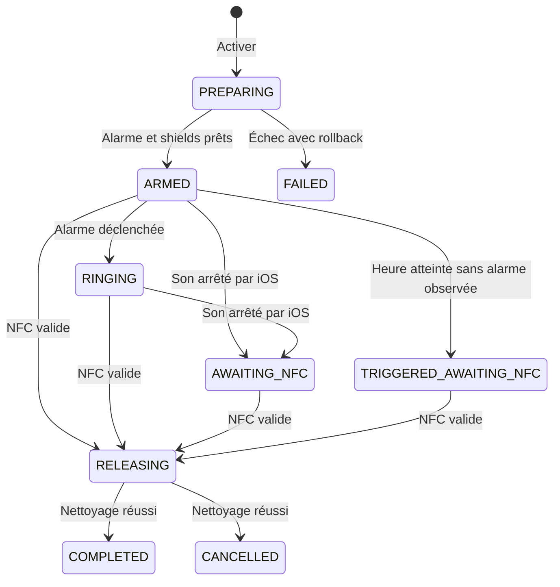

# Niumi iPhone: spécification technique

Statut: prêt pour POC technique; implémentation du MVP conditionnée à la validation du Lot 0 et des points `À REVOIR`
Plateforme: iPhone
Cible minimale: iOS 26.0
Langage: Swift
Interface: SwiftUI
Date de référence: 2 septembre 2026
Contrat métier commun: `SPEC_CORE_KMP.md`

## 1. Objet du document

Ce document décrit la première version iPhone de Niumi. Il sert de cahier des charges à Codex pour créer le projet Xcode, implémenter les fonctions métier, ajouter les extensions iOS nécessaires et écrire les tests.

### 1.1 Convention de revue

- `CORRIGÉ`: l'exigence est suffisamment précise pour être implémentée et testée.
- `À REVOIR · PRODUIT`: une décision produit reste nécessaire avant le MVP.
- `À REVOIR · POC`: le comportement doit être confirmé sur un iPhone physique avec la version cible d'iOS et du SDK.
- `À REVOIR · APPLE`: le point dépend d'une autorisation ou d'une validation de distribution accordée par Apple.

Les points `À REVOIR` ne bloquent pas la création du Lot 0. Ils bloquent le passage de la spec au statut « prête pour implémentation du MVP ».

### 1.2 Synthèse des points à revoir

| Sujet | Statut | Décision ou preuve attendue |
| --- | --- | --- |
| Entitlements Family Controls | `À REVOIR · APPLE` | capacités de distribution accordées pour l'application et les deux extensions |
| `secondaryIntent` après redémarrage | contrainte Apple documentée | indisponible avant le premier déverrouillage; accès manuel à Niumi après déverrouillage |
| Signal de réveil manqué (`TRIGGER_ELAPSED` produit sans que l'application ait observé l'alarme) | exception Apple assumée et documentée en section 12 | aucune notification locale au MVP; le routage vers l'écran de réveil à la réouverture de l'application signale ce cas, et le shield reste un indice actionnable tant que Niumi n'est pas rouvert, avec un texte qui indique explicitement qu'un scan termine la session |
| Ouverture de Niumi depuis un shield | `À REVOIR · POC` | API publique confirmée et parcours acceptable en App Review |
| Fabrication du tag NFC | `À REVOIR · PRODUIT` | technologie physique du tag, écriture, verrouillage et contrôle qualité |

Les décisions produit auparavant ouvertes sont fixées ainsi:

- le MVP ne propose aucun secours logiciel immédiat si le boîtier ou le NFC est indisponible;
- une heure inexistante est avancée au premier instant valide;
- la première occurrence est choisie lorsqu'une heure locale se répète;
- l'instant du réveil est figé après activation;
- le boîtier vérifié pour terminer une session est celui associé au moment de l'activation, figé dans `NiumiSessionRecord`;
- le payload NFC suit exactement le protocole défini dans `SPEC_CORE_KMP.md`.

Niumi permet à une personne de choisir une heure de lever, de bloquer immédiatement certaines applications, puis de terminer la session le lendemain en scannant un boîtier NFC placé hors de la chambre.

La version iPhone doit respecter une limite imposée par iOS: AlarmKit affiche un contrôle système qui permet d'arrêter le son. L'application ne peut pas retirer ce contrôle. Si la personne l'utilise avant le scan NFC, le son s'arrête, mais la session Niumi continue et les applications choisies restent bloquées. Seul un scan NFC valide termine la session dans l'application.

## 2. Résultat attendu

À la fin de l'implémentation, l'application doit permettre de:

1. demander les autorisations AlarmKit et Family Controls au moment où elles deviennent utiles;
2. associer un boîtier NFC Niumi à l'iPhone;
3. sélectionner jusqu'à 50 applications à bloquer;
4. choisir une heure de lever et activer une session;
5. appliquer les écrans de blocage dès l'activation;
6. programmer une alarme système avec AlarmKit;
7. conserver la session si l'application est fermée ou si le son est arrêté depuis le contrôle système;
8. ouvrir le parcours de scan depuis l'alarme ou depuis l'application;
9. vérifier le boîtier localement, sans réseau;
10. arrêter l'alarme encore active, retirer les blocages et clôturer la session après un scan valide;
11. modifier ou annuler une session avant le réveil uniquement après un scan valide;
12. restaurer un état cohérent après une interruption de l'application.

## 3. Périmètre du MVP

### Inclus

- une seule session active à la fois;
- un moteur métier Kotlin Multiplatform partagé avec Android;
- une alarme ponctuelle pour le prochain lever;
- sélection d'applications avec `FamilyActivityPicker`;
- blocage avec `ManagedSettings`;
- écran de blocage personnalisé;
- alarme avec `AlarmKit`;
- bouton secondaire de l'alarme ouvrant le scanner Niumi;
- lecture d'un tag NDEF avec `CoreNFC`;
- fonctionnement hors ligne pour l'ensemble du parcours critique;
- interface en français, prête pour la localisation;
- historique local minimal des sessions terminées;
- journal technique local sans donnée sensible.

### Hors périmètre

- Android;
- compte utilisateur, abonnement et synchronisation serveur;
- réveils récurrents;
- suivi du sommeil;
- statistiques avancées;
- Apple Watch comme application autonome;
- blocage de tout l'iPhone;
- protection contre la désinstallation de Niumi ou la révocation des autorisations dans Réglages;
- tag NFC avec authentification cryptographique;
- garantie de sonnerie si l'iPhone est éteint, sans batterie, si Niumi est désinstallé ou si l'autorisation AlarmKit a été retirée.

## 4. Contraintes iOS à traiter comme des règles produit

### 4.1 Arrêt sonore

`CORRIGÉ`: AlarmKit fournit le contrôle d'arrêt. Niumi ne dépend ni de son libellé ni de son apparence et ne tente pas de les personnaliser. La configuration associe un `AppIntent` à l'arrêt et peut ajouter un bouton secondaire `Scanner Niumi`, dans les limites de l'API publique du SDK cible. Niumi ne peut pas supprimer la possibilité d'arrêter l'alerte.

Conséquence obligatoire:

- l'arrêt sonore et la fin de session sont deux événements différents;
- le contrôle système ne retire jamais les shields;
- l'état après arrêt du son et avant NFC est `AWAITING_NFC`;
- l'application principale convertit le fait natif `alarmStopped` en événement KMP `ALARM_SOUND_STOPPED`;
- l'interface doit expliquer cette distinction sans promettre que le son est impossible à arrêter.

### 4.2 Blocage des applications

Le blocage utilise les API publiques `FamilyControls` et `ManagedSettings`. Il dépend de l'autorisation individuelle accordée par la personne. Niumi ne doit pas tenter d'empêcher l'accès aux Réglages, la suppression de l'application ou la révocation de Family Controls.

`À REVOIR · APPLE`: l'application et chacune des extensions Managed Settings concernées doivent obtenir l'entitlement Family Controls pour la distribution. Les App IDs définitifs, les demandes d'entitlement et la validation d'un build signé sur appareil font partie du Lot 0. La suite du MVP ne démarre pas tant que les cibles prévues ne sont pas signables avec les capacités nécessaires. Une distribution TestFlight doit également être testée dès qu'elle est disponible.

### 4.3 Lecture NFC

La lecture Core NFC s'effectue dans une session visible, avec l'application au premier plan. Niumi ne doit pas compter sur une lecture NFC permanente en arrière-plan.

Le bouton secondaire de l'alarme ouvre l'application sur l'écran de réveil. L'utilisateur lance ensuite le scanner si iOS ne l'a pas déjà présenté. Le parcours doit rester utilisable lorsque l'iPhone est verrouillé: iOS peut demander l'authentification avant d'ouvrir l'application.

Après un redémarrage et avant le premier déverrouillage, Apple ne rend pas le `secondaryIntent` disponible. Le bouton secondaire ne constitue donc pas l'unique accès au scanner. Après le premier déverrouillage, l'ouverture manuelle de Niumi doit afficher immédiatement le parcours de réveil si une session active attend le NFC.

### 4.4 Effet des shields

`CORRIGÉ`: l'application peut demander une configuration `ManagedSettings` et relire la configuration exposée par l'API. Elle ne présente pas cette relecture comme une preuve universelle que le shield est effectivement affiché. Le logiciel distingue donc:

- `shieldRequested`: la configuration Niumi a été écrite;
- `shieldConfigurationReadable`: la configuration attendue a pu être relue;
- `shieldObservedOnDevice`: le shield a été constaté pendant une recette sur iPhone physique.

Seule la recette sur appareil valide l'affichage effectif du shield dans un scénario donné.

### 4.5 Confidentialité des applications choisies

Les jetons renvoyés par `FamilyActivityPicker` sont opaques. Le code ne doit pas chercher à obtenir ou enregistrer les identifiants de bundle des applications sélectionnées. Il stocke uniquement les jetons fournis par le système.

### 4.6 Procédure de secours

`CORRIGÉ`: le MVP ne prévoit aucun déblocage interne immédiat en cas de boîtier perdu, cassé ou illisible. L'interface d'activation prévient que la session restera active tant qu'un scan valide n'aura pas été effectué, sous réserve des contrôles qu'iOS laisse toujours à l'utilisateur dans Réglages. L'assistance explique cette limite sans fournir de code de contournement.

### 4.7 Fabrication et provisionnement NFC

`À REVOIR · PRODUIT`: le format logique du payload est fixé dans cette spec. Chaque boîtier reçoit un UUID canonique et un token aléatoire de 16 octets. Le choix du tag et son processus de fabrication restent ouverts. Avant une production de boîtiers, préciser:

- la technologie et la capacité minimale du tag;
- la génération des UUID et des tokens;
- l'outil qui écrit le message NDEF;
- le verrouillage éventuel du tag après écriture;
- le contrôle qualité et la gestion des doublons;
- la procédure de remplacement d'un boîtier associé.

## 5. Choix techniques

| Domaine | Choix |
| --- | --- |
| Langage | Swift avec concurrence structurée |
| Domaine partagé | `NiumiCore` en Kotlin Multiplatform |
| Interface | SwiftUI |
| Architecture | MVVM léger, services injectés, moteur KMP et coordinateurs natifs |
| Réveil | AlarmKit |
| Actions de l'alarme | App Intents |
| Blocage | FamilyControls et ManagedSettings |
| Sélection d'applications | FamilyActivityPicker |
| Extension de shield | Managed Settings UI Extension |
| Action sur le shield | Shield Action Extension |
| NFC | Core NFC, lecture NDEF |
| Persistance principale | SwiftData |
| État partagé avec extensions | App Group: snapshot publié par l'application et événements immuables écrits par les intents |
| Secret ou identifiant du boîtier | Keychain local, non synchronisé |
| Tests unitaires | Swift Testing |
| Tests d'interface | XCTest et XCUITest |
| Dépendances externes | Framework local `NiumiCore`; aucun package natif tiers pour le MVP |

Le backend ne participe à aucune décision critique. L'application doit pouvoir activer une session, sonner, conserver les shields et valider le boîtier en mode avion.

## 6. Cibles Xcode et capacités

Créer les cibles suivantes:

```text
NiumiApp
NiumiCore, framework généré par Gradle
NiumiShieldConfigurationExtension
NiumiShieldActionExtension
NiumiTests
NiumiUITests
```

Une extension `DeviceActivityMonitor` pourra être ajoutée lors de la phase de durcissement si les essais sur appareil montrent qu'elle améliore la restauration des shields. Elle ne fait pas partie du chemin critique initial tant que son utilité n'est pas démontrée par le POC.

### Capacités de la cible principale

- Family Controls;
- App Groups;
- Near Field Communication Tag Reading;
- Keychain Sharing uniquement si une extension doit lire le même secret;
- aucune capacité supplémentaire tant qu'elle n'est pas justifiée par une fonctionnalité livrée.

### Capacités des extensions

- Family Controls pour les extensions Managed Settings concernées;
- le même App Group que l'application;
- aucune capacité réseau nécessaire.

### Clés `Info.plist`

Ajouter au minimum:

```xml
<key>NSAlarmKitUsageDescription</key>
<string>Niumi utilise les alarmes pour te réveiller à l'heure choisie.</string>
<key>NFCReaderUsageDescription</key>
<string>Niumi lit ton boîtier NFC pour terminer la session et débloquer tes applications.</string>
```

Les textes doivent être localisés. Ne pas demander d'autorisation au premier lancement sans avoir expliqué son utilité dans l'interface.

AlarmKit est utilisé par l'import du framework, la clé `NSAlarmKitUsageDescription` et l'autorisation demandée à l'exécution. La configuration ne requiert aucune capacité Xcode ni entitlement AlarmKit dédié.

### Identifiants à centraliser

Définir les identifiants dans une seule structure de configuration:

```swift
enum AppConfiguration {
    static let appGroup = "group.com.niumi.app"
    static let managedStoreName = "niumi.active-session"
    static let keychainService = "com.niumi.app.nfc"
}
```

Les valeurs finales doivent correspondre au compte Apple Developer et aux bundle identifiers du projet. Codex ne doit pas inventer une Team ID.

## 7. Architecture du code

Organisation recommandée:

```text
Niumi/
  App/
    NiumiApp.swift
    AppEnvironment.swift
    AppRouter.swift
  Domain/
    Services/
      SessionCoordinator.swift
      SessionRecoveryService.swift
    Interop/
      NiumiCoreMapper.swift
      NiumiCoreSessionFacade.swift
    Protocols/
      AlarmScheduling.swift
      AppShielding.swift
      NFCReading.swift
      BoxVerifying.swift
      SessionStoring.swift
      Clock.swift
  Infrastructure/
    AlarmKit/
      AlarmKitScheduler.swift
      NiumiAlarmMetadata.swift
      AlarmUpdateObserver.swift
    FamilyControls/
      FamilyControlsAuthorizationService.swift
      ManagedSettingsShieldService.swift
      SelectionStore.swift
    NFC/
      CoreNFCReader.swift
      NiumiCoreBoxAdapter.swift
    Persistence/
      SwiftDataSessionStore.swift
      SharedSessionSnapshotStore.swift
      SharedSessionEventStore.swift
      KeychainBoxStore.swift
    Diagnostics/
      LocalEventLogger.swift
  Features/
    Onboarding/
    Home/
    AppSelection/
    BoxPairing/
    SessionSetup/
    ActiveSession/
    WakeUp/
    Settings/
  Shared/
    Components/
    Localization/
    ExtensionsSupport/
NiumiShieldConfigurationExtension/
NiumiShieldActionExtension/
NiumiTests/
NiumiUITests/
../shared/core/
```

### Règles d'architecture

- les vues SwiftUI ne parlent pas directement à AlarmKit, Core NFC ou ManagedSettings;
- `NiumiCoreFacade` est l'unique composant autorisé à réduire les événements en transitions métier;
- `SessionCoordinator` convertit les faits iOS en événements KMP et exécute les effets retournés;
- aucun service, intent, store ou modèle SwiftData ne modifie directement l'état métier;
- chaque API système est placée derrière un protocole pour permettre les tests;
- les identifiants de session et d'alarme utilisent `UUID`;
- les dates persistées utilisent `Date`; la saisie d'heure utilise `DateComponents`;
- les erreurs système sont converties en erreurs métier compréhensibles;
- aucun singleton métier, sauf les singletons imposés par les frameworks Apple encapsulés dans un service;
- toutes les opérations d'interface et de coordination qui modifient l'état observable s'exécutent sur `MainActor`;
- aucune `fatalError`, aucun `try!` et aucun déballage forcé dans le code de production.

### Intégration du framework KMP

La cible principale importe:

```swift
import NiumiCore
```

Le module `:shared:core` déclare un framework statique `NiumiCore`. Ajouter avant `Compile Sources` une phase Xcode qui exécute:

```sh
if [ "YES" = "$OVERRIDE_KOTLIN_BUILD_IDE_SUPPORTED" ]; then
  exit 0
fi

cd "$SRCROOT/.."
./gradlew :shared:core:embedAndSignAppleFrameworkForXcode
```

Adapter le chemin `cd` à l'emplacement réel du projet. Désactiver `Based on dependency analysis` pour cette phase et désactiver `User Script Sandboxing` pour la cible concernée. Les extensions ne sont pas obligées d'importer KMP; elles lisent un snapshot Swift versionné dont le mapping vers les DTO communs est testé.

## 8. Modèle de données

### `NiumiSessionRecord`

SwiftData persiste un enregistrement natif qui se convertit vers `SessionSnapshotDto`. Il ne contient aucun réducteur Swift concurrent de KMP.

```swift
@Model
final class NiumiSessionRecord {
    @Attribute(.unique) var id: UUID
    var alarmID: UUID
    var schemaVersion: Int
    var revision: Int64
    var localDateISO: String
    var localTimeISO: String
    var zoneIDAtActivation: String
    var scheduledFireDate: Date
    var boxID: UUID
    var boxTokenSha256Hex: String
    var stateCode: String
    var releaseTargetCode: String?
    var healthCode: String
    var createdAt: Date
    var armedAt: Date?
    var ringingAt: Date?
    var alarmSoundStoppedAt: Date?
    var triggerElapsedAt: Date?
    var nfcVerifiedAt: Date?
    var releasingAt: Date?
    var completedAt: Date?
    var cancelledAt: Date?
    var failureCode: String?
}
```

`revision` reste positive et augmente à chaque décision métier acceptée. `stateCode`, `releaseTargetCode` et `healthCode` utilisent les codes canoniques du contrat KMP. Un code inconnu produit une erreur de migration ou de corruption; il n'est pas remplacé par une valeur par défaut. SwiftData permet un aller-retour complet avec `SessionSnapshotDto`.

`boxID` et `boxTokenSha256Hex` sont copiés depuis le Keychain à l'étape `ACTIVATION_REQUESTED` et figés pour la durée de la session. `SessionCoordinator.handleValidNFC()` vérifie toujours le scan contre ces deux valeurs de la session active, jamais contre le Keychain courant, afin qu'une ré-association ne puisse pas changer le boîtier attendu d'une session en cours. Le parcours d'association reste de toute façon inaccessible pendant une session active (section 14).

### État métier

Les neuf états proviennent de `NiumiCore`:

```text
PREPARING
ARMED
RINGING
AWAITING_NFC
TRIGGERED_AWAITING_NFC
RELEASING
COMPLETED
CANCELLED
FAILED
```

Les vues Swift peuvent convertir ces valeurs en modèles d'affichage. Elles ne déclarent pas une seconde enum de transitions.

### Sélection d'applications

Conserver la `FamilyActivitySelection` encodée et versionnée dans le conteneur App Group. Prévoir dès la première version un `schemaVersion`, une migration contrôlée et un comportement explicite si la sélection devient illisible. Ne pas dupliquer les jetons dans les logs, SwiftData, analytics ou payloads réseau.

### `SharedSessionSnapshot`

Les extensions ont besoin d'un état petit et stable. Utiliser un snapshot `Codable` versionné dans un fichier du conteneur App Group:

```swift
struct SharedSessionSnapshot: Codable, Sendable {
    let projectionSchemaVersion: Int
    let domainSchemaVersion: Int
    let domainRevision: Int64
    let sessionID: UUID
    let alarmID: UUID
    let localDateISO: String
    let localTimeISO: String
    let zoneIDAtActivation: String
    let scheduledFireDate: Date
    var stateCode: String
    var releaseTargetCode: String?
    var healthCode: String
    var alarmSoundStoppedAt: Date?
    var triggerElapsedAt: Date?
    var nfcVerifiedAt: Date?
    var releasingAt: Date?
    let updatedAt: Date
}
```

`CORRIGÉ`: SwiftData est la source de vérité persistante de l'application. Le snapshot App Group est une projection publiée uniquement par `SessionCoordinator` après une décision de `NiumiCoreFacade`. Les App Intents et les extensions ne réécrivent jamais ce snapshot.

Le snapshot App Group est une projection partielle, pas un modèle destiné à un aller-retour complet avec le DTO KMP. Chaque publication reprend exactement `domainRevision`; elle ne l'incrémente pas. Le coordinateur accepte une republication de la même révision et refuse une révision inférieure. Le store partagé doit être couvert par des tests de migration, de corruption et de régression de révision. En cas de donnée illisible, l'application ne retire pas silencieusement un shield qui semble encore actif.

### `SharedSessionEvent`

Les processus externes à l'application publient des faits immuables dans le conteneur App Group:

```swift
struct SharedSessionEvent: Codable, Identifiable, Sendable {
    enum Kind: String, Codable, Sendable {
        case alarmStopped
    }

    let schemaVersion: Int
    let id: UUID
    let sessionID: UUID
    let alarmID: UUID
    let kind: Kind
    let occurredAt: Date
}
```

Chaque événement utilise un fichier distinct dont le nom dépend de son UUID. L'écriture se fait dans un fichier temporaire puis par remplacement atomique. Au lancement et au retour au premier plan, `SessionCoordinator`:

1. lit les événements valides;
2. les trie par `occurredAt`, puis par `id` pour obtenir un ordre stable;
3. ignore les événements d'une autre session ou d'une alarme inconnue;
4. vérifie dans le registre SwiftData si l'événement a déjà été reçu;
5. convertit chaque fait nouveau en `SessionEventDto`, l'applique avec son reçu et ses effets dans une transaction, puis publie un nouveau snapshot;
6. marque les événements comme consommés avant leur suppression différée.

Un doublon strict ne relance pas le moteur ni les effets. La réutilisation d'un identifiant avec un payload différent produit `EVENT_ID_CONFLICT`. Un événement ancien ou partiellement écrit ne doit jamais faire régresser la phase ni retirer un shield.

SwiftData conserve un reçu par événement avec `eventId`, `sessionID`, l'empreinte canonique du payload et la révision appliquée. Il conserve aussi une outbox avec `effectId`, `sessionID`, `revision`, `kind`, le payload sérialisé de l'effet, l'état d'exécution et la dernière erreur. Un effet `RECORD_INCIDENT` garde ainsi le code, la gravité, l'horodatage et la plateforme nécessaires à sa reprise. La transaction qui accepte un événement écrit le reçu, le snapshot canonique et l'outbox. Les effets interrompus sont repris au prochain passage du coordinateur.

### Boîtier associé

`CORRIGÉ`: pour le MVP, le tag contient un UUID aléatoire et un token de 16 octets dans un enregistrement NDEF URI:

```text
niumi://box/v1/550e8400-e29b-41d4-a716-446655440000?token=AAAAAAAAAAAAAAAAAAAAAA
```

Le payload valide respecte exactement les règles suivantes:

- schéma ASCII minuscule `niumi`;
- hôte ASCII minuscule `box`;
- deux segments de chemin seulement: `v1` puis un UUID canonique minuscule;
- UUID au format `8-4-4-4-12`, sans accolades;
- query composée uniquement de `token`, présent exactement une fois;
- token de 16 octets encodé en Base64 URL sans padding, soit 22 caractères;
- aucun utilisateur, mot de passe, port ou fragment;
- aucune séquence encodée par pourcentage;
- longueur maximale du payload URI: 96 octets UTF-8;
- aucun octet nul ni caractère de contrôle.

Le parseur compare les composants attendus et reconstruit ensuite la forme canonique. Il n'accepte pas une URI simplement parce qu'une normalisation permissive la rendrait équivalente.

Le Keychain enregistre le `boxId` canonique et l'empreinte SHA-256 des 16 octets du token, avec une accessibilité limitée à l'appareil et sans synchronisation iCloud. Comparer les empreintes en temps constant. Ne jamais journaliser le token, sa forme encodée ou son empreinte complète.

Un simple tag NDEF peut être copié. L'interface et la documentation produit ne doivent pas le présenter comme inviolable. Un futur boîtier anti-clonage devra utiliser un tag capable de répondre à un challenge cryptographique.

## 9. Machine à états



### Transitions autorisées

| État courant | Événement KMP | État suivant | Effet |
| --- | --- | --- | --- |
| aucun | `ACTIVATION_REQUESTED` | `PREPARING` | persister une transaction provisoire |
| `PREPARING` | `ACTIVATION_SUCCEEDED` | `ARMED` | publier le snapshot actif |
| `PREPARING` | `ACTIVATION_FAILED` | `FAILED` | annuler l'alarme et retirer les shields de cette transaction |
| `ARMED` | `ALARM_FIRED` | `RINGING` | afficher le parcours de réveil à la prochaine ouverture |
| `ARMED` ou `RINGING` | `ALARM_SOUND_STOPPED` | `AWAITING_NFC` | conserver les shields et présenter la demande de scan |
| `ARMED` | `TRIGGER_ELAPSED` | `TRIGGERED_AWAITING_NFC` | conserver les shields et présenter la demande de scan |
| `TRIGGERED_AWAITING_NFC` | `ALARM_SOUND_STOPPED` | état inchangé | conserver les shields et la demande de scan |
| `ARMED`, avant `triggerAtEpochMillis` | `VALID_NFC_SCANNED` | `RELEASING` | cibler `CANCELLED`, persister `nfcVerifiedAt` et retirer la demande de scan |
| `RINGING`, `AWAITING_NFC` ou `TRIGGERED_AWAITING_NFC` | `VALID_NFC_SCANNED` | `RELEASING` | cibler `COMPLETED`, persister `nfcVerifiedAt` et retirer la demande de scan |
| `RELEASING` | `RELEASE_FAILED` | `RELEASING` | enregistrer l'incident et reprendre les effets manquants |
| `RELEASING` | `RELEASE_SUCCEEDED` | cible enregistrée | supprimer le pointeur de session active |

Aucune action d'interface ne doit atteindre `COMPLETED` ou `CANCELLED` sans `nfcVerifiedAt` et `RELEASE_SUCCEEDED`. Pendant `RELEASING`, certains shields peuvent déjà être retirés: l'état seul ne permet pas de déduire la configuration effective de ManagedSettings. Un événement dupliqué, ancien ou destiné à une autre session ne fait jamais régresser la révision.

`VALID_NFC_SCANNED` reçu depuis `ARMED` à ou après `triggerAtEpochMillis` est refusé par le moteur avec `TRIGGER_ALREADY_ELAPSED`. `SessionCoordinator.handleValidNFC()` (section 15) réconcilie systématiquement l'état AlarmKit avant un scan depuis `ARMED` et envoie d'abord `ALARM_FIRED` ou `TRIGGER_ELAPSED` selon le fait observé, si bien que ce refus reste un filet de sécurité et ne doit jamais se produire en parcours normal.

## 10. Autorisations et contrôle de santé

### Autorisation AlarmKit

Utiliser `AlarmManager.shared.authorizationState` puis `requestAuthorization()` si l'état est indéterminé. Si l'autorisation est refusée, ne pas créer de session et afficher un accès direct aux réglages de l'application lorsque le système le permet.

### Autorisation Family Controls

Demander:

```swift
try await AuthorizationCenter.shared.requestAuthorization(for: .individual)
```

Ne jamais présenter le sélecteur d'applications avant l'autorisation. Si elle est révoquée pendant une session, l'application doit signaler que le blocage n'est plus garanti. Elle ne doit pas marquer la session comme terminée pour autant.

### Préflight avant activation

L'activation est possible uniquement si:

- AlarmKit est autorisé;
- Family Controls est autorisé;
- entre 1 et 50 applications sont sélectionnées;
- un boîtier est associé;
- Core NFC est disponible sur l'appareil;
- aucune autre session n'est active;
- l'heure calculée est dans le futur;
- le snapshot partagé est accessible;
- le stockage local est accessible.

Les contrôles natifs sont convertis vers les DTO et les niveaux `ReadinessSeverity` de `NiumiCore`. `NiumiCoreFacade.evaluateActivation()` décide si l'activation est permise. L'interface présente une action iOS précise pour chaque problème.

## 11. Création d'une session

### Calcul de la date

Pour une heure choisie `HH:mm`:

1. construire la date correspondante dans le calendrier et le fuseau courants;
2. si elle est inférieure ou égale à maintenant, choisir le prochain jour civil;
3. appliquer la règle de changement d'heure définie ci-dessous;
4. afficher la date complète avant confirmation, par exemple `Demain à 07:00`;
5. enregistrer la `Date` finale dans la session.

Le MVP programme une date absolue avec `Alarm.Schedule.fixed`. Un changement de fuseau après activation ne doit pas modifier silencieusement l'instant enregistré. L'écran actif affiche l'heure locale correspondant à cet instant. Le produit pourra adopter un horaire relatif dans une version ultérieure si le besoin est confirmé.

`CORRIGÉ`: le calcul appartient à `NiumiCore`. Si l'heure locale choisie n'existe pas, utiliser le premier instant valide après le saut. Si elle existe deux fois, choisir la première occurrence. Après `ACTIVATION_SUCCEEDED`, l'instant devient immuable. Une programmation `Alarm.Schedule.fixed` est déjà absolue: un changement d'heure ou de fuseau vérifie l'alarme et ne la reprogramme que si elle manque ou diffère, puis recalcule seulement l'affichage local.

### Transaction d'activation

`SessionCoordinator.activate()` exécute les étapes suivantes:

1. lancer le préflight;
2. créer les UUID de session et d'alarme;
3. envoyer `ACTIVATION_REQUESTED` à `NiumiCoreFacade`;
4. persister atomiquement `PREPARING`, le reçu de l'événement et l'outbox, puis créer le snapshot partagé;
5. programmer l'alarme avec AlarmKit;
6. appliquer les shields à la sélection enregistrée;
7. relire la configuration demandée lorsque l'API le permet, sans en déduire que le shield est effectivement affiché;
8. envoyer `ACTIVATION_SUCCEEDED` au moteur commun;
9. persister et publier `ARMED`;
10. enregistrer un événement local `session_armed`.

Si une étape échoue après la programmation de l'alarme, annuler cette alarme. Si les shields ont été appliqués, les retirer uniquement pour le store nommé de la transaction. Envoyer ensuite `ACTIVATION_FAILED` avec `failureCode`, persister `FAILED`, supprimer le pointeur actif et conserver la trace de l'échec dans l'historique local.

### Configuration AlarmKit

Utiliser une configuration d'alarme sans snooze pour le MVP:

```swift
let configuration = AlarmManager.AlarmConfiguration.alarm(
    schedule: .fixed(session.scheduledFireDate),
    attributes: attributes,
    stopIntent: NiumiStopIntent(
        sessionID: session.id.uuidString,
        alarmID: session.alarmID.uuidString
    ),
    secondaryIntent: OpenScannerIntent(sessionID: session.id.uuidString)
)

try await AlarmManager.shared.schedule(
    id: session.alarmID,
    configuration: configuration
)
```

Cet extrait fixe l'intention, pas une signature à recopier sans vérification. Codex doit utiliser les types et initialisateurs publics du SDK installé, puis conserver exactement les comportements décrits ici. L'absence de son personnalisé doit laisser AlarmKit employer son son système par défaut.

Présentation de l'alarme:

- titre: `Il est temps de te lever`;
- contrôle Stop système: contrôle fourni par iOS, sans dépendance à son libellé ou à son apparence;
- `AlarmPresentation.Alert` contient un `secondaryButton` libellé `Scanner Niumi` avec `secondaryButtonBehavior: .custom`;
- couleur: couleur d'accent Niumi;
- son: son système par défaut dans le POC, puis fichier audio validé et inclus dans le bundle.

Le `secondaryIntent` définit l'action du bouton secondaire. Il ne suffit pas, à lui seul, à afficher ce bouton : la présentation conserve la configuration `.custom` ci-dessus.

Ne pas ajouter de compte à rebours, snooze ou Live Activity visuelle au MVP. La conformité des intents à `LiveActivityIntent`, exigée par AlarmKit, n'ajoute ni interface Live Activity ni Widget Extension.

## 12. Gestion des actions AlarmKit

### `NiumiStopIntent`

Cet intent conforme à `LiveActivityIntent` s'exécute en arrière-plan lorsque la personne utilise le contrôle Stop système. Il doit:

1. valider les formats de `sessionID` et `alarmID`;
2. écrire un événement immuable `alarmStopped` dans un fichier distinct du conteneur App Group;
3. ne pas réécrire le snapshot partagé;
4. ne jamais appeler le service de déblocage;
5. ne jamais effacer la sélection;
6. terminer rapidement, sans réseau.

Au prochain lancement ou retour au premier plan, `SessionCoordinator` consomme l'événement, le convertit en `ALARM_SOUND_STOPPED` et appelle `NiumiCoreFacade`. Si la décision est valide, il persiste `alarmSoundStoppedAt`, met à jour SwiftData, puis publie `AWAITING_NFC`. L'intent ne devient jamais un second propriétaire de la machine à états et n'importe pas le moteur KMP.

### `OpenScannerIntent`

Cet intent conforme à `LiveActivityIntent` reçoit le `sessionID`, déclare un `supportedModes` au premier plan immédiat et ouvre l'application sur la route `wakeUp(sessionID:)`. Il ne définit pas `openAppWhenRun`, API obsolète. La vue vérifie que l'identifiant correspond à la session active avant de proposer le scan.

Les paramètres des deux intents traversent la frontière système sous forme de chaînes canoniques. Ils sont reconvertis en `UUID` avec validation avant toute lecture ou écriture. Une valeur absente, mal formée ou différente de la session active produit un résultat sans effet.

### Observation de l'alarme

`AlarmUpdateObserver` écoute `AlarmManager.shared.alarmUpdates` pendant que l'application est active. Il transmet `ALARM_FIRED` et les autres faits observables à `SessionCoordinator`, mais ne constitue pas une source de vérité indépendante. À chaque lancement, retour au premier plan et avant un scan depuis `ARMED`, un acteur ou un mutex unique consomme d'abord les événements partagés, puis compare:

- la session SwiftData;
- le snapshot App Group;
- l'état connu par AlarmKit;
- la configuration exposée par le store ManagedSettings.

Si le Stop est observé, le coordinateur produit `ALARM_SOUND_STOPPED`. Il lit ensuite `try AlarmManager.shared.alarms`, propriété dont l'accès peut échouer, puis recherche l'alarme de la session. Seul l'état `.alerting` produit `ALARM_FIRED`. Une alarme `.scheduled` observée avant l'heure conserve la session dans `ARMED`.

À l'heure ou après, une lecture réussie sans alarme `.alerting`, y compris une liste vide ou une liste ne contenant plus l'alarme ponctuelle, produit `TRIGGER_ELAPSED`. Une erreur de lecture n'est jamais assimilée à une liste vide : le coordinateur enregistre l'incident `IOS_ALARM_STATE_READ_FAILED` avec la gravité `DEGRADED`. À l'heure ou après, il produit tout de même `TRIGGER_ELAPSED` d'après l'horloge avant le scan, afin qu'un scan NFC valide ne puisse pas annuler la session. Avant l'heure, le scan valide conserve le parcours vers `CANCELLED`; les effets de libération annulent l'alarme de façon idempotente. La réconciliation traite ces faits avant `VALID_NFC_SCANNED` et reste idempotente.

`ALARM_SOUND_STOPPED` et `TRIGGER_ELAPSED` exécutent l'effet commun `PRESENT_SCAN_REQUEST`: dès que le coordinateur produit l'un de ces événements, il route immédiatement vers l'écran de réveil (`wakeUp(sessionID:)`) si l'application est active. Un scan valide exécute ensuite `CLEAR_SCAN_REQUEST`.

Ce routage ne remplace pas une notification système: il ne s'exécute que pendant que l'application observe l'alarme, c'est-à-dire au lancement, au retour au premier plan ou avant un scan. Si le réveil est manqué et que la personne n'a pas rouvert Niumi, seuls les shields signalent que la session est encore active. Le contrôle Stop système et le bouton secondaire `Scanner Niumi` restent les seuls déclencheurs immédiats côté iOS: le MVP n'ajoute pas de notification locale `UNUserNotificationCenter` pour ce cas.

C'est une exception assumée à l'invariant commun qui demande un signal natif visible pour toute session bloquante en attente de scan (`SPEC_CORE_KMP.md`, section 4). Elle est compensée en gardant le shield actionnable: son sous-titre (section 13) indique explicitement qu'un scan du boîtier termine la session, afin que la personne qui rouvre une application bloquée sache quoi faire même sans être passée par l'écran de réveil.

## 13. Blocage des applications

### Sélection

Présenter `FamilyActivityPicker` dans une feuille. Accepter les jetons d'applications. Les catégories et domaines web restent désactivés dans le MVP sauf décision produit contraire.

Règles:

- au moins 1 application;
- au plus 50 jetons d'application;
- une nouvelle sélection remplace l'ancienne hors session;
- sélection et association du boîtier sont non modifiables pendant une session active;
- l'interface affiche le nombre d'applications choisies, sans tenter d'extraire leurs identifiants privés.

### Application des shields

Utiliser un store nommé partagé:

```swift
let store = ManagedSettingsStore(named: .init(AppConfiguration.managedStoreName))
store.shield.applications = selection.applicationTokens
```

Pour retirer uniquement les restrictions Niumi:

```swift
store.clearAllSettings()
```

Ne jamais utiliser une opération globale qui pourrait retirer les réglages d'une autre fonction ou d'une autre application.

### Shield Configuration Extension

L'écran système doit rester sobre:

- titre: `Cette app est bloquée`;
- sous-titre: `Scanne ton boîtier Niumi pour la débloquer.`;
- bouton principal: `Retour`;
- bouton secondaire facultatif: `Ouvrir Niumi` uniquement si le Lot 0 confirme une API publique et un comportement acceptable en App Review. `À REVOIR · POC`

Le sous-titre doit rester actionnable même sans snapshot lisible: il est le seul signal restant pour une session dont le réveil est passé sans que l'application ait été rouverte, comme documenté en section 12. Ne pas afficher l'heure de réveil si l'extension ne peut pas lire un snapshot valide. Ne pas afficher le nom de l'application bloquée obtenu par une méthode non publique.

### Shield Action Extension

Le bouton du shield ne doit jamais autoriser temporairement l'application. L'extension ferme le shield ou reporte l'action selon la réponse publique disponible dans le SDK. Elle peut diriger vers Niumi, mais ne change pas la phase et ne retire aucun réglage.

## 14. Association et lecture du boîtier NFC

### Association initiale

Le parcours d'association est autorisé uniquement lorsqu'aucune session n'est active:

1. expliquer où placer le boîtier;
2. démarrer une `NFCNDEFReaderSession`;
3. accepter un seul tag;
4. lire le premier message NDEF compatible;
5. transmettre l'URI au parseur KMP et valider le schéma, la version, l'identifiant et le token;
6. demander confirmation;
7. enregistrer le `boxId` canonique et l'empreinte du token dans le Keychain;
8. invalider la session NFC avec un message de réussite.

### Scan du matin

Le scanner du matin:

1. vérifie qu'une session active existe;
2. démarre une session Core NFC;
3. ignore les enregistrements non compatibles;
4. refuse un boîtier différent sans révéler l'identifiant attendu;
5. limite les nouvelles tentatives rapides pour éviter une boucle d'interface;
6. transmet la `NfcVerificationProof` opaque renvoyée par KMP avec `VALID_NFC_SCANNED` après comparaison valide.

Messages:

| Situation | Texte |
| --- | --- |
| attente | `Approche ton iPhone du boîtier Niumi.` |
| mauvais tag | `Ce n'est pas le boîtier associé à cet iPhone.` |
| lecture impossible | `Le boîtier n'a pas pu être lu. Réessaie.` |
| NFC indisponible | `Le scan NFC n'est pas disponible sur cet iPhone.` |
| réussite | `Session terminée. Tes applications sont de nouveau accessibles.` |

### Validation du payload

Le lecteur Core NFC transmet l'URI brute au parseur de `NiumiCore`. Swift ne duplique aucune règle de validité. Le parseur commun doit:

- refuser tout schéma autre que `niumi`;
- exiger l'hôte `box`;
- exiger la version `v1`;
- exiger un UUID canonique minuscule au format `8-4-4-4-12`;
- exiger une query composée uniquement de `token`, présent une fois;
- exiger un token Base64 URL sans padding de 22 caractères qui décode exactement 16 octets;
- refuser tout port, identifiant utilisateur, fragment, encodage par pourcentage, paramètre ou segment supplémentaire;
- refuser un payload URI de plus de 96 octets UTF-8;
- ne jamais exécuter ni ouvrir l'URI lue;
- être fuzzé avec des payloads vides, trop longs, mal encodés ou comportant des segments supplémentaires.

## 15. Fin de session

`SessionCoordinator.handleValidNFC()` suit cet ordre:

1. consommer les événements App Group et interroger AlarmKit sous le même acteur que la réconciliation;
2. si l'état est `ARMED`, produire d'abord `ALARM_SOUND_STOPPED`, `ALARM_FIRED` ou `TRIGGER_ELAPSED` selon le fait observé;
3. vérifier de nouveau le boîtier scanné contre `boxID` et `boxTokenSha256Hex` de `NiumiSessionRecord` (jamais contre le Keychain courant) avec le parseur et le vérificateur `NiumiCore`;
4. créer l'identifiant d'événement et l'horodatage, puis envoyer `VALID_NFC_SCANNED` au moteur commun avec la `NfcVerificationProof` opaque retournée par `verifyBox()` pour cette session et cette révision;
5. persister atomiquement `nfcVerifiedAt`, `releaseTarget`, `RELEASING`, le reçu et l'outbox dans SwiftData;
6. publier le snapshot avec la même `domainRevision`;
7. demander à AlarmKit d'arrêter ou d'annuler l'alarme si elle est encore active;
8. retirer les réglages du store ManagedSettings Niumi;
9. relire la configuration demandée lorsque l'API le permet;
10. envoyer `RELEASE_SUCCEEDED` au moteur commun seulement lorsque les effets requis ont réussi;
11. persister `COMPLETED` ou `CANCELLED` avec son horodatage;
12. supprimer le pointeur de session active et la sélection temporaire partagée;
13. conserver l'entrée d'historique;
14. afficher la confirmation adaptée à la cible finale.

Un scan depuis `ARMED` avant l'heure fixe `releaseTarget = CANCELLED`. Un scan depuis `RINGING`, `AWAITING_NFC` ou `TRIGGERED_AWAITING_NFC` fixe `releaseTarget = COMPLETED`.

Si l'application s'interrompt après l'étape 3, la restauration reprend la publication du snapshot puis les effets manquants. La présence de `nfcVerifiedAt` dans SwiftData autorise cette reprise. Sans cette valeur, le mécanisme de récupération ne retire pas les shields.

Les erreurs d'arrêt AlarmKit après un arrêt déjà effectué sont tolérées et journalisées. Une erreur ManagedSettings ou une autre erreur partielle produit `RELEASE_FAILED`, conserve `RELEASING`, enregistre `RELEASE_PARTIAL_FAILURE` et reprend uniquement les effets incomplets. L'application ne réapplique pas un shield déjà retiré et n'affiche pas la confirmation finale avant `RELEASE_SUCCEEDED`. La relecture logicielle ne remplace pas la recette sur appareil.

Les effets requis pour `RELEASE_SUCCEEDED` sont l'arrêt ou l'annulation de l'alarme (étape 7) et le retrait des réglages ManagedSettings Niumi (étape 8); la relecture de la configuration à l'étape 9 est best-effort et consignée sans bloquer la phase en cas d'échec. Si l'autorisation Family Controls a déjà été révoquée par l'utilisateur avant le scan, le retrait des réglages est considéré satisfait dès que `AuthorizationCenter.shared` ne rapporte plus l'autorisation individuelle, avec un incident `BLOCKING_PERMISSION_REVOKED` consigné, plutôt que de bloquer indéfiniment `RELEASING`.

## 16. Restauration et cohérence

Exécuter `SessionRecoveryService.reconcile()`:

- au lancement;
- au retour au premier plan;
- après une modification d'autorisation détectée;
- après toute erreur partielle d'activation ou de fin.

### Règles de réconciliation

| Situation | Action |
| --- | --- |
| événement `alarmStopped` valide et non consommé | le convertir en `ALARM_SOUND_STOPPED`, le réduire via KMP, publier le snapshot, router vers l'écran de réveil, puis le marquer comme consommé |
| session `PREPARING`, alarme présente, sélection valide | reprendre les effets puis envoyer `ACTIVATION_SUCCEEDED` |
| session `PREPARING`, aucune alarme | exécuter le rollback puis envoyer `ACTIVATION_FAILED` avec `failureCode` |
| session `ARMED`, alarme en état `.alerting` | envoyer `ALARM_FIRED` avant toute action NFC |
| session `ARMED`, alarme ponctuelle absente après l'heure | envoyer `TRIGGER_ELAPSED` puis router vers l'écran de réveil avant toute action NFC |
| session active, configuration Niumi absente, Family Controls autorisé | redemander la configuration des shields |
| session active, Family Controls révoqué | conserver la session et afficher un diagnostic bloquant |
| `nfcVerifiedAt` présent et état `RELEASING` | comparer les effets natifs et reprendre ceux qui manquent, sans restaurer les shields déjà retirés |
| aucune session active, store Niumi encore configuré | vérifier l'historique et nettoyer uniquement si aucun snapshot actif valide n'existe |
| snapshot corrompu avec configuration Niumi présente | afficher une récupération explicite et journaliser, sans nettoyage silencieux |

Le service est idempotent: deux appels consécutifs avec les mêmes entrées produisent le même état final.

## 17. Écrans et navigation

### Onboarding

Ordre recommandé:

1. explication du fonctionnement;
2. autorisation AlarmKit;
3. autorisation Family Controls;
4. association du boîtier;
5. sélection des applications;
6. arrivée sur l'accueil.

Chaque étape peut être reprise. Ne pas présenter deux demandes système en même temps.

### Accueil sans session

Contenu:

- heure de lever;
- date calculée;
- nombre d'applications sélectionnées;
- état du boîtier;
- bouton `Activer la session`;
- problèmes de préflight, s'il y en a.

### Confirmation

Avant activation, afficher clairement:

- la date et l'heure de l'alarme;
- le nombre d'applications bloquées;
- le fait que le blocage commence immédiatement;
- le fait qu'un scan du boîtier sera nécessaire pour terminer la session;
- la limite iOS: le son peut être arrêté par le contrôle système, mais les applications resteront bloquées.

### Session active

Afficher:

- `Session active`;
- date et heure du lever;
- nombre d'applications bloquées;
- état `Alarme programmée`, `En attente du scan` après un arrêt du son, ou `Réveil manqué, scan attendu` si `TRIGGER_ELAPSED` a été produit à l'ouverture de l'application sans qu'elle ait observé une alarme `.alerting`;
- pour l'état `Réveil manqué, scan attendu`, préciser que l'heure de réveil est passée et qu'un scan reste nécessaire, sans affirmer que l'alarme n'a jamais sonné: le contrôle Stop système et le bouton `Scanner Niumi` n'ont de toute façon pas pu servir de signal tant que l'application n'a pas été rouverte;
- bouton `Scanner le boîtier` lorsque le parcours de réveil est actif;
- bouton `Modifier ou annuler` dans `ARMED`; ce bouton ouvre le scanner et ne change aucun état avant un scan valide;
- progression non interruptible pendant `RELEASING`;
- aucun bouton de déblocage direct.

### Réveil

L'écran de réveil met le scan au premier plan. Il ne comporte aucun bouton `Terminer`, `Ignorer` ou `Débloquer`. Une fermeture de l'écran ne modifie pas la session.

### Réglages

Hors session, permettre de:

- changer le boîtier associé;
- modifier les applications choisies;
- consulter l'état des autorisations;
- consulter une courte explication des limites iOS;
- effacer l'historique local.

Pendant une session, désactiver les deux premières actions dans les réglages. La modification ou l'annulation passe uniquement par le parcours dédié de la session active et son scan NFC.

## 18. Gestion des erreurs

Créer une enum métier `NiumiError` couvrant au minimum:

- `alarmAuthorizationDenied`;
- `familyControlsAuthorizationDenied`;
- `familyControlsEntitlementUnavailable`;
- `noApplicationsSelected`;
- `boxNotPaired`;
- `nfcUnavailable`;
- `invalidBoxPayload`;
- `wrongBox`;
- `alarmSchedulingFailed`;
- `shieldApplicationFailed`;
- `persistenceFailed`;
- `stateCorrupted`;
- `releaseFailed`.

Chaque erreur comporte:

- un identifiant stable pour les tests et diagnostics;
- un message localisé;
- une action de récupération facultative;
- une cause technique conservée uniquement dans le journal local.

Ne pas afficher les descriptions brutes de `NSError` dans l'interface.

## 19. Journalisation et vie privée

Le journal local peut contenir:

- identifiant aléatoire de session;
- type d'événement;
- date;
- phase avant et après;
- code d'erreur normalisé;
- version d'iOS et modèle d'appareil pour le diagnostic.

Il ne doit jamais contenir:

- jetons Family Controls;
- identifiant NFC brut ou condensat complet;
- contenu NDEF complet;
- liste des applications;
- données de compte;
- son capturé, photo, position ou contact.

Aucune télémétrie distante n'est requise dans le MVP. Si elle est ajoutée, le réveil, le blocage et le déblocage ne doivent pas attendre son résultat.

## 20. Accessibilité et qualité d'interface

- toutes les actions ont un libellé VoiceOver;
- la sélection et le statut ne reposent pas uniquement sur la couleur;
- Dynamic Type ne doit couper ni l'heure ni les actions principales;
- les zones tactiles respectent les recommandations Apple;
- l'interface prend en charge le mode sombre;
- les textes utilisent le tutoiement de façon constante;
- les animations respectent `Reduce Motion`;
- le scanner reste compréhensible sans retour haptique;
- aucun écran ne masque la limite du contrôle Stop d'iOS.

## 21. Sécurité et anti-contournement raisonnable

Le MVP doit empêcher les contournements internes évidents:

- aucune route ou action de debug dans le build Release pour terminer une session;
- aucune modification directe du boîtier ou de la sélection pendant la session; avant le réveil, le parcours dédié exige d'abord un scan valide;
- aucune suppression des shields déclenchée par `NiumiStopIntent`;
- validation NFC locale avant écriture de `nfcVerifiedAt`;
- Keychain non synchronisé;
- secrets absents des logs;
- contrôles d'intégrité sur les données partagées;
- schémas de deep link stricts et liés à la session active.

Niumi ne prétend pas résister à une personne qui désinstalle l'application, retire les autorisations dans Réglages ou modifie l'appareil. Ces actions restent sous le contrôle d'iOS.

## 22. Stratégie de tests

### Tests unitaires obligatoires

`:shared:core` couvre dans `commonTest`:

- calcul du prochain réveil avant et après l'heure choisie;
- passage à l'heure d'été et à l'heure d'hiver;
- conservation de l'instant après changement de fuseau;
- transitions autorisées et refusées de la machine à états;
- passage de `ARMED` à `RELEASING` avec cible `CANCELLED` avant `triggerAtEpochMillis`;
- refus de `VALID_NFC_SCANNED` depuis `ARMED` à ou après `triggerAtEpochMillis`, avec `TRIGGER_ALREADY_ELAPSED`;
- passage de `RINGING`, `AWAITING_NFC` ou `TRIGGERED_AWAITING_NFC` à `RELEASING` avec cible `COMPLETED`;
- `TRIGGER_ELAPSED` avant, à et après l'heure prévue;
- maintien de `RELEASING` après `RELEASE_FAILED`;
- état final uniquement après `RELEASE_SUCCEEDED`;
- arrêt sonore sans retrait des shields;
- parseur NDEF canonique et cas invalides;
- token absent, dupliqué, paddé, trop court ou mal encodé;
- comparaison du boîtier;
- événements dupliqués, anciens ou hors session, et identifiant réutilisé avec un payload différent;
- validation de `failureCode` et de l'effet des gravités `WARNING`, `DEGRADED` et `CRITICAL`;
- refus d'une régression de `revision`;
- sélections de 0, 1, 50 et 51 applications;
- `PRESENT_SCAN_REQUEST` produit par `ALARM_SOUND_STOPPED` et par `TRIGGER_ELAPSED`, `CLEAR_SCAN_REQUEST` produit par `VALID_NFC_SCANNED`, tous deux rejouables sans effet en double.

`NiumiTests` couvre:

- rollback de chaque étape d'activation;
- idempotence de la fin de session;
- reprise depuis `RELEASING`;
- mapping aller-retour entre SwiftData et les DTO KMP, puis mapping de projection pour le snapshot App Group;
- vérification effectuée contre `boxID` et `boxTokenSha256Hex` de `NiumiSessionRecord`, refusée si le Keychain a changé depuis l'activation;
- conversion de `alarmStopped` vers `ALARM_SOUND_STOPPED`;
- routage vers l'écran de réveil déclenché par `PRESENT_SCAN_REQUEST` au lancement et au retour au premier plan;
- réconciliation sérialisée d'une alarme `.scheduled`, `.alerting`, absente après lecture réussie ou illisible, avant, exactement à et après l'heure, avant un scan;
- incident `IOS_ALARM_STATE_READ_FAILED`, sa gravité `DEGRADED` et le déclenchement d'après l'horloge malgré l'erreur après l'heure;
- présentation `AlarmPresentation.Alert` avec `secondaryButtonBehavior: .custom` et libellé `Scanner Niumi`;
- redémarrage avant le premier déverrouillage, sans dépendance au `secondaryIntent`;
- corruption et migration du snapshot;
- événements partagés concurrents, dupliqués, anciens, corrompus ou hors session;
- republication de la même `domainRevision` et refus d'une régression;
- migration et corruption de `FamilyActivitySelection`;
- absence de secret dans les événements journalisés;
- révocation de chaque autorisation;
- écriture atomique du reçu, du snapshot et de l'outbox; exécution et reprise idempotentes des effets KMP.

Utiliser des fakes pour `AlarmScheduling`, `AppShielding`, `NFCReading`, `SessionStoring` et `Clock`. Les tests unitaires ne doivent pas dépendre d'un iPhone ni d'une heure réelle.

### Tests d'intégration

- persistance SwiftData puis relance;
- lecture et écriture du snapshot App Group;
- partage de l'état avec les App Intents;
- publication atomique et consommation idempotente des événements App Group;
- configuration et action des shields;
- programmation, observation et arrêt d'une alarme AlarmKit dans un environnement pris en charge.

### Tests UI

- onboarding complet;
- refus puis reprise d'une autorisation;
- activation d'une session;
- retour dans une session active après relance;
- accès au scanner depuis la route de réveil;
- mauvais boîtier puis bon boîtier;
- état `AWAITING_NFC` après simulation de Stop;
- annulation avant réveil après scan valide;
- reprise de l'interface pendant `RELEASING`;
- réglages non modifiables pendant une session.

### Recette obligatoire sur iPhone physique

Core NFC et le comportement réel d'une alarme ne doivent pas être validés uniquement dans le simulateur.

Matrice minimale:

| Scénario | Résultat attendu |
| --- | --- |
| iPhone verrouillé | AlarmKit présente l'alarme système |
| mode silencieux | l'alarme reste proéminente selon AlarmKit |
| mode Concentration actif | l'alarme reste proéminente selon AlarmKit |
| application fermée | alarme et shields restent opérationnels |
| mode avion | parcours complet opérationnel |
| Stop système avant NFC | son arrêté, applications toujours bloquées |
| scan du mauvais boîtier | session inchangée |
| scan valide pendant ou après le réveil | passage par `RELEASING`, alarme arrêtée, blocage retiré, puis `COMPLETED` |
| scan valide avant le réveil | passage par `RELEASING`, alarme annulée, blocage retiré, puis `CANCELLED` |
| alarme `.scheduled` avant l'heure | session `ARMED`; scan valide vers `CANCELLED` |
| alarme `.scheduled` exactement à l'heure | production de `TRIGGER_ELAPSED`, puis scan valide vers `COMPLETED` |
| alarme `.scheduled` après l'heure | production de `TRIGGER_ELAPSED`, puis scan valide vers `COMPLETED` |
| alarme `.alerting` | production de `ALARM_FIRED`, puis scan valide vers `COMPLETED` |
| liste AlarmKit vide après lecture réussie, avant l'heure | session `ARMED`; scan valide vers `CANCELLED` |
| liste AlarmKit vide après lecture réussie, exactement à l'heure | production de `TRIGGER_ELAPSED`, puis scan valide vers `COMPLETED` |
| liste AlarmKit vide après lecture réussie, après l'heure | production de `TRIGGER_ELAPSED`, puis scan valide vers `COMPLETED` |
| lecture AlarmKit en erreur avant l'heure | incident `IOS_ALARM_STATE_READ_FAILED`, parcours d'annulation conservé et annulation idempotente de l'alarme |
| lecture AlarmKit en erreur exactement à l'heure | incident `IOS_ALARM_STATE_READ_FAILED`, `TRIGGER_ELAPSED` d'après l'horloge, puis scan valide vers `COMPLETED` |
| lecture AlarmKit en erreur après l'heure | incident `IOS_ALARM_STATE_READ_FAILED`, `TRIGGER_ELAPSED` d'après l'horloge, puis scan valide vers `COMPLETED` |
| réouverture de Niumi après un réveil manqué, application restée fermée | `TRIGGER_ELAPSED` produit à l'ouverture, routage immédiat vers l'écran de réveil affichant `Réveil manqué, scan attendu`, shields toujours actifs |
| interruption pendant `RELEASING` | effets manquants repris sans déblocage incohérent |
| autorisation Family Controls révoquée | diagnostic visible, aucune fausse promesse de blocage |
| autorisation AlarmKit révoquée avant activation | activation refusée |
| redémarrage, avant le premier déverrouillage | le `secondaryIntent` est indisponible; le parcours conserve l'accès manuel à Niumi après déverrouillage |
| redémarrage, après le premier déverrouillage | l'ouverture manuelle affiche le scanner et l'état est réconcilié |
| boîtier perdu ou illisible | aucun secours logiciel immédiat; limite et contrôles iOS expliqués |
| changement de fuseau après activation | instant absolu conservé et affichage local cohérent |
| batterie ou réseau indisponible | aucun appel réseau requis |

## 23. Critères d'acceptation

La version iPhone est acceptée si tous les critères suivants sont remplis:

1. une session ne peut être activée sans alarme autorisée, sélection de 1 à 50 applications et boîtier associé;
2. la configuration de shield est demandée immédiatement après une activation réussie, puis son affichage est confirmé pendant la recette sur appareil;
3. l'alarme est enregistrée dans AlarmKit pour la date affichée;
4. la fermeture de l'application ne termine pas la session;
5. le contrôle Stop système ne retire jamais les shields;
6. seul un tag accepté par le parseur et le vérificateur KMP, avec sa `NfcVerificationProof` opaque, produit `VALID_NFC_SCANNED`;
7. un tag valide crée `nfcVerifiedAt` et `RELEASING` avant toute tentative de déblocage;
8. après un tag valide, l'alarme encore active est arrêtée et le store Niumi est nettoyé avant `RELEASE_SUCCEEDED`;
9. le parcours critique fonctionne sans connexion;
10. un échec partiel peut être repris sans laisser un état contradictoire ni restaurer un shield déjà retiré;
11. un App Intent ne modifie jamais directement le snapshot ou SwiftData;
12. des événements partagés concurrents ou dupliqués ne font jamais régresser la session;
13. aucun test ne dépend d'un service distant;
14. le projet compile sans avertissement nouveau;
15. tous les tests unitaires passent;
16. la recette sur appareil confirme le scénario Stop système puis NFC;
17. l'interface ne promet jamais que le son est impossible à arrêter sur iPhone.
18. un scan depuis `ARMED` avant l'heure termine en `CANCELLED`;
19. un scan depuis `RINGING`, `AWAITING_NFC` ou `TRIGGERED_AWAITING_NFC` termine en `COMPLETED`;
20. un changement de fuseau conserve l'instant et recalcule seulement l'affichage local;
21. les tests `commonTest`, les mappings Swift et la construction de `NiumiCore` passent dans la CI;
22. `ALARM_SOUND_STOPPED` et `TRIGGER_ELAPSED` routent immédiatement vers l'écran de réveil lorsque l'application est active, et la recette sur appareil confirme qu'une réouverture après un réveil manqué affiche `Réveil manqué, scan attendu` sans que le son ait jamais sonné.

## 24. Ordre d'implémentation pour Codex

### Lot 0: POC de faisabilité

Créer une branche de prototype et valider sur iPhone physique:

1. les App IDs définitifs des trois cibles distribuées;
2. les demandes d'entitlement Family Controls pour l'application et les deux extensions;
3. un build signé sur iPhone physique;
4. une alarme AlarmKit avec contrôle Stop et bouton `Scanner Niumi`;
5. la réception du `stopIntent`;
6. l'ouverture de l'application par `OpenScannerIntent`;
7. le comportement après redémarrage avant et après le premier déverrouillage;
8. un shield appliqué à une application choisie;
9. la lecture d'un tag NDEF conforme au format canonique;
10. le maintien du shield après Stop;
11. le retrait du shield après scan;
12. une distribution TestFlight dès que les autorisations Apple le permettent.

Bloquer la suite si l'un de ces comportements diffère de la documentation ou du produit attendu. Documenter le résultat avec la version exacte d'iOS et du SDK.

### Lot 0.5: contrat commun KMP

- ajouter `:shared:core` au monorepo;
- implémenter la machine à états, la politique horaire et le protocole NFC de `SPEC_CORE_KMP.md`;
- exposer `NiumiCoreFacade` et ses DTO simples;
- créer les fixtures et les tests `commonTest`;
- intégrer `NiumiCore` dans une cible iOS minimale avec `embedAndSignAppleFrameworkForXcode`;
- valider la consommation du même module par Android et la CI macOS.

### Lot 1: domaine et persistance

- mappings entre KMP, SwiftData et le snapshot App Group;
- protocoles et coordinateurs d'effets iOS;
- SwiftData;
- snapshot App Group;
- journal d'événements App Group;
- Keychain;
- tests unitaires Swift complémentaires aux tests communs.

### Lot 2: autorisations et configuration

- onboarding;
- AlarmKit;
- Family Controls;
- association NFC;
- sélection des applications;
- préflight.

### Lot 3: session active

- transaction d'activation;
- ManagedSettings;
- AlarmKit;
- App Intents;
- écran de session;
- réconciliation.

### Lot 4: réveil et fin de session

- route depuis l'alarme;
- scanner;
- validation;
- `RELEASING` et cible finale;
- nettoyage idempotent;
- reprise après `RELEASE_FAILED`;
- confirmation.

### Lot 5: extensions et durcissement

- shield personnalisé;
- action du shield;
- tests sur appareil;
- accessibilité;
- localisation;
- gestion des erreurs;
- journal local.

## 25. Consignes d'exécution pour Codex

- commencer par inspecter le dépôt et ses instructions locales;
- ne pas remplacer une architecture existante sans justification;
- implémenter le Lot 0 avant les écrans complets;
- compiler après chaque lot;
- exécuter les tests pertinents après chaque modification;
- ne pas masquer un échec de build ou de signature;
- ne pas ajouter de package externe sans besoin démontré et accord explicite;
- ne pas créer de faux comportement AlarmKit, Family Controls ou NFC dans le build Release;
- conserver les fakes dans les cibles de test ou derrière une compilation Debug;
- traiter les avertissements de concurrence Swift comme des défauts;
- utiliser uniquement des API publiques Apple;
- laisser un rapport final avec les fichiers modifiés, les commandes de test, les résultats et les points qui nécessitent encore un appareil physique ou un entitlement de distribution.

## 26. Définition de terminé

Un lot est terminé lorsque:

- son code compile;
- ses tests passent;
- les tests `commonTest` et les tests de mapping passent;
- le framework `NiumiCore` est construit et intégré dans Xcode;
- aucune donnée sensible n'apparaît dans les logs;
- les erreurs visibles sont localisées;
- les changements d'état sont idempotents;
- le comportement sur appareil est documenté lorsque le simulateur ne suffit pas;
- la documentation du dépôt reflète le comportement réellement implémenté.

Le MVP complet n'est pas terminé tant que le POC sur iPhone physique n'a pas confirmé la limite du contrôle Stop, le maintien des shields et le déblocage après un scan NFC valide.

## 27. Références Apple et KMP

- [AlarmKit](https://developer.apple.com/documentation/alarmkit)
- [Programmer une alarme avec AlarmKit](https://developer.apple.com/documentation/alarmkit/scheduling-an-alarm-with-alarmkit)
- [Contrôle Stop système de l'alerte](https://developer.apple.com/documentation/alarmkit/alarmpresentation/alert-swift.struct/init%28title%3Asecondarybutton%3Asecondarybuttonbehavior%3A%29)
- [Configuration d'une alarme AlarmKit](https://developer.apple.com/documentation/alarmkit/alarmmanager/alarmconfiguration)
- [AlarmKit et `LiveActivityIntent`](https://developer.apple.com/documentation/alarmkit/alarmmanager/alarmconfiguration/alarm%28schedule%3Aattributes%3Astopintent%3Asecondaryintent%3Asound%3A%29)
- [État des alarmes AlarmKit](https://developer.apple.com/documentation/alarmkit/alarmmanager/alarms)
- [Énumération `Alarm.State`](https://developer.apple.com/documentation/alarmkit/alarm/state-swift.enum)
- [Comportement `.custom` du bouton secondaire](https://developer.apple.com/documentation/alarmkit/alarmpresentation/alert-swift.struct/secondarybuttonbehavior-swift.enum/custom)
- [`openAppWhenRun`, API obsolète](https://developer.apple.com/documentation/appintents/appintent/openappwhenrun?changes=_3)
- [Autorisation AlarmKit](https://developer.apple.com/documentation/alarmkit/alarmmanager/requestauthorization%28%29)
- [`NSAlarmKitUsageDescription`](https://developer.apple.com/documentation/bundleresources/information-property-list/nsalarmkitusagedescription)
- [Capacités iOS prises en charge](https://developer.apple.com/help/account/reference/supported-capabilities-ios)
- [Family Controls](https://developer.apple.com/documentation/familycontrols)
- [Autorisation individuelle Family Controls](https://developer.apple.com/documentation/familycontrols/authorizationcenter/requestauthorization%28for%3A%29)
- [Demande de l'entitlement Family Controls](https://developer.apple.com/documentation/familycontrols/requesting-the-family-controls-entitlement)
- [FamilyActivityPicker](https://developer.apple.com/documentation/familycontrols/familyactivitypicker)
- [ManagedSettings](https://developer.apple.com/documentation/managedsettings)
- [ManagedSettingsStore](https://developer.apple.com/documentation/managedsettings/managedsettingsstore)
- [Applications couvertes par un shield](https://developer.apple.com/documentation/managedsettings/shieldsettings/applications-swift.property)
- [Core NFC](https://developer.apple.com/documentation/corenfc)
- [Créer une application de lecture NFC](https://developer.apple.com/documentation/corenfc/building-an-nfc-tag-reader-app)
- [Plugin Android Gradle pour une bibliothèque KMP](https://developer.android.com/kotlin/multiplatform/plugin)
- [Intégration directe du framework KMP dans Xcode](https://kotlinlang.org/docs/multiplatform/multiplatform-direct-integration.html)
- [Méthodes d'intégration iOS de Kotlin Multiplatform](https://kotlinlang.org/docs/multiplatform/multiplatform-ios-integration-overview.html)
